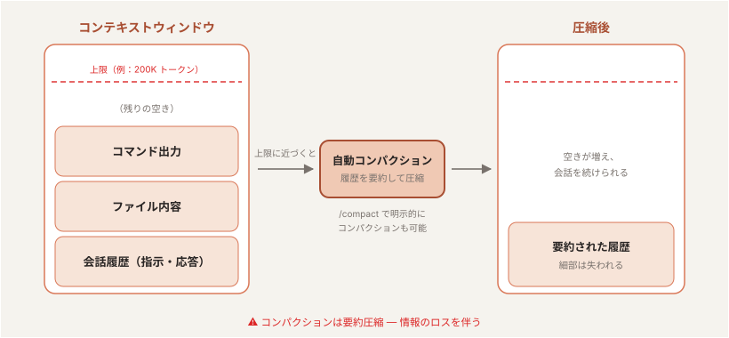
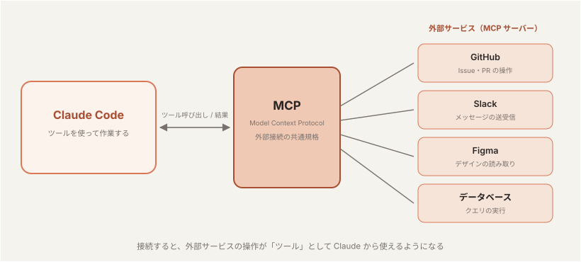
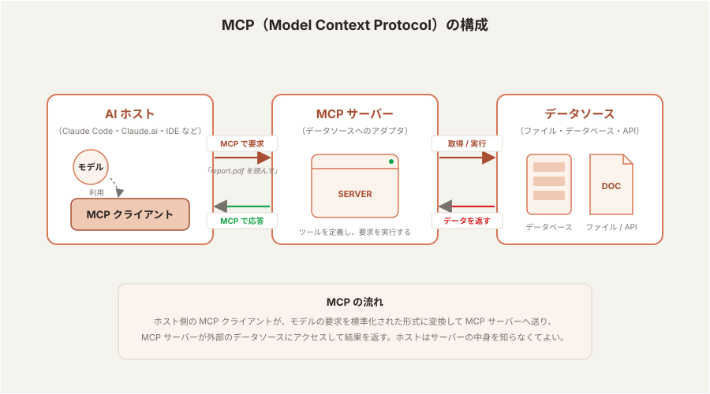
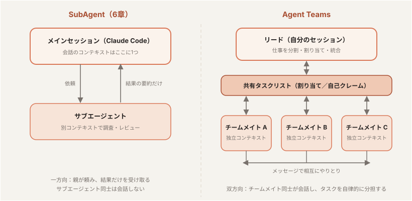
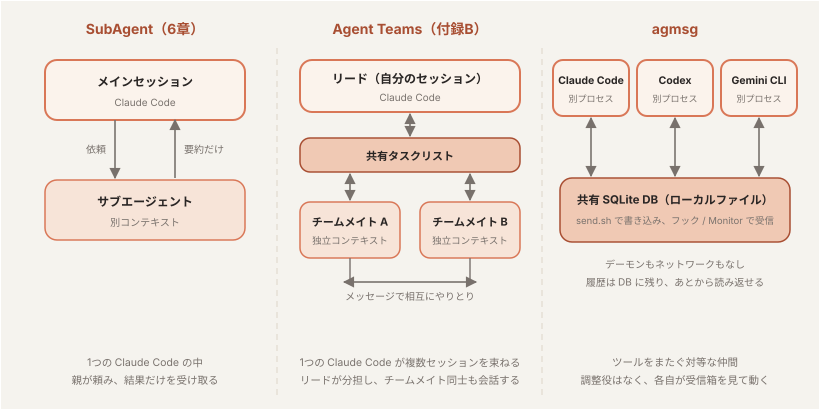
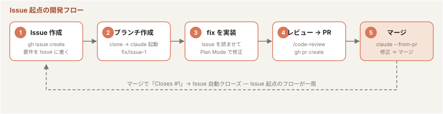
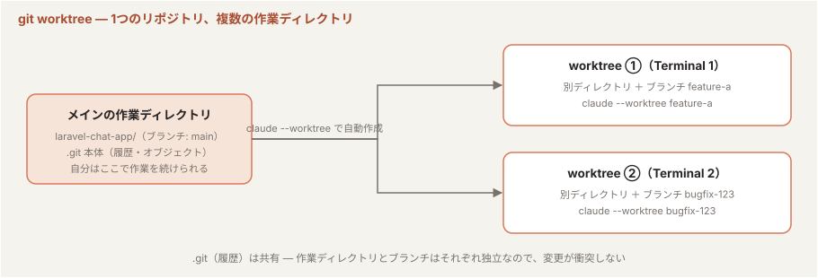
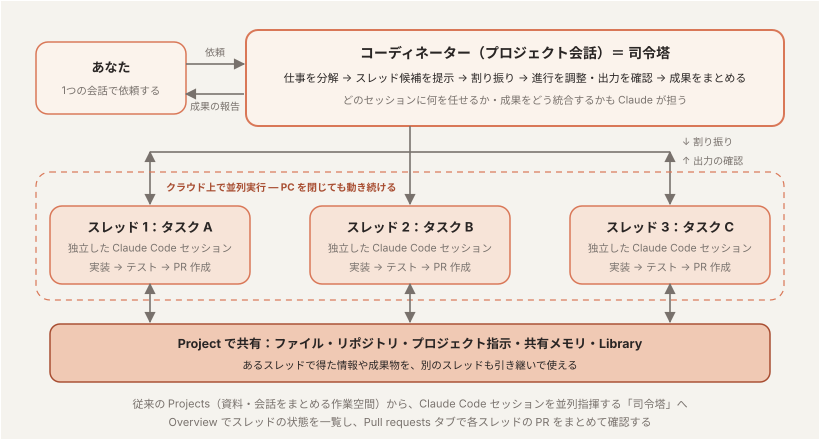

# Claude Code ハンズオン

## ハンズオン概要

### 対象

* ソフトウェア開発エンジニア
* 前提：
  * CLI や Git の基本操作には慣れている
  * Claude Code は未経験 〜 入門レベル
  * AI 駆動開発（Agentic Coding）を実践したい方

### ゴール

本コース終了後、受講者が以下を実施できる状態を目指す。

* Claude Code の基本操作・コマンド・使い方を理解し、日常業務に導入できる
* [1] Claude Code を使って **ソースコードの解析** を実行できる
* [2] Claude Code を使って **ソフトウェア開発** を実行できる
* [3] Claude Code を使って **チーム開発** を実行できる

### 前提知識

* Git / GitHub の基本操作
* ターミナル操作
* ソフトウェア開発の基本知識
* VS Code 等のエディタ利用経験

### 前提環境

* Claudeサブスクリプションが各自に提供されている
* macOS / Linux / Windows PC
* Cursor / VSCode が入っている（必要に応じて）
* Claude Codeインストール済み
* Gitコマンド、および、ghコマンドが入っている
* sqlite3 が入っている（題材の agmsg で使用）

### コース構成（全3 Section・計5.5時間）

| Section | テーマ | 主な内容 | 実践 |
|---|---|---|---|
| Section 1 | Claude Code の基本 | Claude Code とは / 基本的な使い方 / コマンド | Claude Code を使ったソースコード解析 |
| Section 2 | Claude Code を使ったソフトウェア開発 | 設定ファイル / Skills・プラグイン / skill-creator / コネクタ / MCP / SubAgent / Hooks | Claude Code を使ったコード変更 |
| Section 3 | Claude Code を使ったチーム開発 | CLAUDE.md・Skills の共有 / プロジェクトナレッジの整理 | チーム開発フローの体験 |

---

# Section 1：Claude Code の基本

## テーマ

「目標：Claude Code の基本操作・コマンド体系を理解し、日常業務で利用できるようになる」

## 到達目標

* Claude Code の基本設定を理解する
* 主要なスラッシュコマンド・特殊プレフィックス・キーボードショートカットを使える
* 既存リポジトリに対して、構造把握 → 該当箇所の特定 → 質問 → サマリ取得の一連を回せる

## 時間配分（90分）

| #  | 内容（約1.5時間・手を動かしながら進めます） | 時間 |
|----|---------------------------------------------|------|
| 1  | オープニング                  | 4分  |
| 2  | Claude Code とは？            | 12分 |
| 3  | 基本的な使い方                | 19分 |
| 4  | Claude Code の設定ファイル    | 5分  |
| 5  | Claude Code を使ってみよう！  | 6分  |
| 6  | コマンド                      | 10分 |
| 7  | 実践：ソースコードの解析      | 15分 |
| 8  | まとめ                        | 4分  |
| 9  | 質疑応答                      | 15分 |

---

### 2. Claude Code とは？（12分）

#### 2-1. Claude Code（3分）

* Anthropic が提供する **エージェント型コーディングツール**
* CLI（ターミナル）/ VS Code / JetBrains / Claude Desktop / Web (`claude.ai/code`) の **5つの入口** がある
* 本コースでは **CLI（ターミナル）** を中心に扱う

#### 2-2. Claude.ai との違い（2分）

| 観点          | Claude.ai（チャット）   | Claude Code（AIエージェント）       |
|---------------|--------------------------|--------------------------------------|
| ファイルアクセス | コピペで渡した範囲のみ  | ローカルファイルに直接アクセス       |
| 実行           | テキスト返答のみ         | ファイル編集・コマンド実行を自分で行う |
| ループ         | 人間が結果を貼り戻す     | 自分でエラーを読み、自分で直す         |
| 必要な仕組み   | ─                        | **承認モデル**（ハーネス）              |

#### 2-3. AIエージェントの動き（4分）

##### エージェントループ


1. **プロンプトを受け取る。** ユーザの入力に加えて、Claude Code が用意する指示（システムプロンプト）・使えるツールの一覧・これまでの会話履歴をまとめて受け取る。
2. **評価して応答する。** Claude が今の状況を見て、どう進めるか決める。テキストで答える／ツールを使う（ファイル読込・編集・コマンド実行など）／その両方、のいずれか。
3. **ツールを実行する。** 要求されたツールを実行し、結果を Claude に返す。この結果が次の判断材料になる。Hooks を使えば、ツールの実行を **実行前に止めたり書き換えたり** できる（Section 2）。
4. **繰り返す。** ステップ 2 と 3 を繰り返す。この 1 サイクルが **1 ターン**。ツールを使わずに答えだけ返せる状態になるまで続く。
5. **結果を返す。** 最終的な回答テキストを返し、その作業で使った **トークン量・コスト・セッション ID** も確認できる（`/usage` や `/status` で見られる）。

ユーザは **ループの途中で割り込み・方針修正・コンテキスト追加** ができる。

#### 2-4. 用語説明（3分）

##### モデル

* ここでは **Large Language Model（LLM）** を指す。コンテキスト（入力）を受け取り、その続きをトークン単位で予測して文章やコードを生成する「頭脳」。Claude Code では **考える・判断するのがモデル、ファイル操作やコマンド実行を担うのがハーネス**（後述）
* 学習データには **締切（knowledge cutoff）** があり、それ以降の出来事や新しいライブラリは知らないが、Web 検索やドキュメントを読ませて補うことができる
* **モデル単体では、セッションや会話を跨ぐ記憶はない**。知っているのは今コンテキストに入っている内容だけ → エージェントがこれまでの会話の記録を保持し渡すことで、一連の会話として成り立つ
* Anthropic 社のモデルファミリーは以下。上位モデルほど賢いが、トークン単価と応答時間も増える:

| モデル | 特徴 | 使いどころ |
|--------|------|-----------|
| Fable | 最上位 | 最も難しい推論・長時間の自律的なエージェント作業 |
| Opus | 高性能 | 複雑な設計判断・大規模なリファクタリング |
| Sonnet | 性能・速度・コストのバランス型 | 日常的な開発タスクの主力 |
| Haiku | 最速・低コスト | 簡単な質問・定型作業 |

* コンテキストウィンドウの大きさもモデルで決まる（Fable / Opus / Sonnet 系は 1M トークン、Haiku 4.5 は 200K トークン。2026年時点）
* 切り替えは `/model`、思考の深さは `/effort`（3-3）。日常は既定のモデルで進め、設計判断や難しいバグ調査だけ Opus / Fable に上げるのが基本の使い方

##### トークン

* LLM が文章を処理する **最小単位**（英語は約4文字 ≒ 1トークン、日本語は1〜2文字 ≒ 1トークン）
* コンテキストウィンドウの上限はトークン数で決まる（例：200K トークン）
* 利用量（レートリミット）も入出力のトークン数で計算される — `/usage` で確認できるのはこれ


参考: トークン分割を体験できるツール（OpenAI Tokenizer） — <https://platform.openai.com/tokenizer>

##### セッション

* `claude` の起動から終了までの **1つの対話単位**。会話履歴（コンテキスト）はセッションごとに保持される
* 終了しても履歴は残っており、`claude --continue`（直前）や `claude -r`（一覧から選択）で再開できる
* セッションが変わるとコンテキストはまっさらになる — **1タスク1セッション** が使い方の基本


##### コンテキスト

* 会話・ファイル内容・コマンド出力すべてが **コンテキストウィンドウ** に積まれる
* 同じセッションで会話を続けていくと **コンテキストウィンドウを消費していく**
* 上限に近づくと **自動コンパクション**（要約圧縮）が走る — **情報のロスを伴う**



##### ハーネス

* モデル（LLM）を実用的なエージェントとして動かすための **周辺機構の総称**
* ツール実行・パーミッション管理・コンテキスト管理（コンパクション）・セッション管理などを担う
* **Claude Code = モデル + ハーネス**。同じモデルでもハーネスの出来でエージェントの性能は大きく変わる


##### パーミッション

* ツール実行（ファイル編集・コマンド実行など）の前に **ユーザの承認を求める** 仕組み。ハーネスの安全機構
* 読み取り系は確認なしで実行され、**書き込みやコマンド実行は承認が必要**（Default モードの場合）
* 確認の度合いは承認モード（3-4）で切り替えられ、settings.json の `permissions`（4-2）で事前にルール化もできる


---

### 3. 基本的な使い方（19分）

#### 3-1. インストール（4分）

##### macOS / Linux / WSL

```bash
# 推奨: 公式インストーラ（auto-update 対応）
curl -fsSL https://claude.ai/install.sh | bash

# 代替: Homebrew（auto-update なし）
brew install --cask claude-code
```

##### Windows

```powershell
# PowerShell（推奨）
Invoke-RestMethod https://claude.ai/install.ps1 | Invoke-Expression
```

```cmd
# CMD
curl -fsSL https://claude.ai/install.cmd -o install.cmd && install.cmd
```

コマンドを使わず、以下のページからインストーラをダウンロードしてインストールすることもできる:

<https://claude.com/ja/download>

> ⚠️ **Windows の注意：デスクトップアプリだけでは CLI は使えない**
> Windows では、上記ページのデスクトップアプリをダウンロード・インストールしただけでは `claude` コマンド（CLI）は使えない。PowerShell で次を実行して CLI をインストールする:
>
> ```
> Invoke-RestMethod https://claude.ai/install.ps1 | Invoke-Expression
> ```
>
> 実行後、「システムの詳細設定の表示」→「詳細設定」→「環境変数」→「〇〇のユーザー環境変数」の `Path` に、インストールされたパスを登録する。


> 💡 **TIPS：gh コマンドが入っていない場合**
> macOS では Homebrew でインストールできる:
>
> ```
> brew install gh
> ```
>
> Windows では winget でインストールできる:
>
> ```
> winget install --id GitHub.cli
> ```
>
> インストールと設定（`gh auth login` など）の参考: `https://qiita.com/s_yasunaga/items/110d21828bd4f578850d`

##### 動作確認

```bash
cd <あなたのプロジェクト>
claude
```
* テーマ選択 → サインイン方法選択（Claude Pro/Max/Enterprise / API キー / Bedrock 等）
* 起動ディレクトリ配下に **すべてアクセスできる** → 機密ディレクトリでは起動しない

起動に成功すると、以下のようなウェルカム画面が表示される。


新しいフォルダで初めて起動すると、**そのフォルダを信頼するか** の確認が表示される。


* Claude Code は起動ディレクトリ配下を **読み取り・編集・コマンド実行** できる。そのための起動時にユーザに確認を行います（ハーネス機能）
* 自分が作った／信頼できるプロジェクト（自分のコード・有名な OSS・チームの成果物）なら `1. Yes, I trust this folder`
* 心当たりのないフォルダなら、中身を確認するまでは `2. No, exit` で抜ける

##### 初回サインイン

* 初回起動時はブラウザが開き、Claude アカウントでのサインイン（サブスクリプションの認証）が行われる

#### 3-2. 起動・終了・再開（3分）

| 操作                     | 方法                                   |
|--------------------------|----------------------------------------|
| 起動                     | プロジェクト直下で `claude`            |
| 終了                     | `Ctrl + C` を 2 回 / `/exit`           |
| **直前の続きから再開**   | `claude --continue`                    |
| 過去のセッションを選んで再開 | `claude -r`（`--resume`）           |
| セッションに名前を付ける | `claude -n <name>`（`--name <name>`）  |
| 非対話で 1 問だけ        | `claude -p "..."`                      |

##### パーミッションスキップ（上級者向け）

| オプション                              | 挙動                                                                 |
|-----------------------------------------|----------------------------------------------------------------------|
| `--dangerously-skip-permissions`        | すべてのパーミッション確認をスキップして実行する                     |
| `--allow-dangerously-skip-permissions`  | スキップを既定では無効のまま、セッション中に選択できるようにする     |

> ⚠️ いずれも **インターネットアクセスのないサンドボックス環境でのみ** 推奨。隔離された環境以外では使わないこと。

#### 3-3. スラッシュコマンド（9分）

まず最初に実施しておきたいコマンドを順に紹介する。

##### `/status` — セッション状態の確認

バージョン・サインイン情報・使用モデル・MCP サーバの状態など、現在のセッションの全体像を一覧表示する。「いま自分がどの環境・どのモデルで動いているか」を最初に確認する習慣をつける。


##### `/config` — 設定の確認・変更

Auto-compact / Thinking mode / 既定のパーミッションモードなど、Claude Code の動作設定を対話的に確認・変更できる。


設定項目の `Language` を変更すると、Claude Code の出力言語を日本語にできる。


##### `/usage` — 利用量の確認

現在のセッション・週単位の利用量（レートリミットの消費状況）を確認できる。リセット時刻も表示されるので、長時間の作業前にチェックすると安心。


##### `/model` — モデルの切り替え

用途に応じてモデルを切り替える。日常タスクは Sonnet、素早い回答が欲しいときは Haiku、といった使い分けができる。


##### `/effort` — 思考の深さの調整

`low` 〜 `max` の5段階で「速さ ⇔ 賢さ」のトレードオフを調整する。簡単な質問は低く、難しい設計判断は高く。


##### `/init` — CLAUDE.md の生成

リポジトリ全体を解析して、プロジェクトメモリ（`CLAUDE.md`）を自動生成する。プロジェクトで最初に一度実行しておくと、以後のセッションで Claude がプロジェクトの構造・規約を踏まえて動くようになる。


生成された `CLAUDE.md` は、**`claude` を起動したディレクトリ（プロジェクトルート）直下** に作成される。

```
<プロジェクトルート>/
├── CLAUDE.md   ← ここに作成される
├── app/
├── routes/
└── ...
```

##### その他の基本コマンド

| コマンド          | 説明                                               |
|-------------------|----------------------------------------------------|
| `/help`           | コマンド一覧                                       |
| `/exit`           | セッション終了                                     |

> 💡 **TIPS：プライバシー設定（Pro / Max プラン加入者）**
> Pro / Max プランを使っている場合は、最初に `/privacy-settings` を実行して設定を確認しておくとよい。ここで **会話データをモデルの学習（トレーニング）に使わせないようにオプトアウト** できる。業務コードを扱うなら、まずこの設定を見直しておくと安心。
> - 学習をオフにすると、データ保持期間も短くなる
> - ウェブからも変更可能：`https://claude.ai/settings/data-privacy-controls`

##### 演習1

紹介したコマンドを実際に実行して、自分の環境を確認・整備する。

1. プロジェクト直下で `claude` を起動する
2. `/status` で バージョン・サインイン状態・使用モデルを確認する
3. `/config` で `Language` を `Japanese` に変更する
4. `/usage` で現在の利用量とリセット時刻を確認する
5. `/model` と `/effort` で現在の設定を確認する（変更してもよい）
6. `/init` を実行して `CLAUDE.md` を生成し、どんな内容が書かれたか眺めてみる

#### 3-4. 承認モードと Plan Mode（3分）

| モード         | ステータスバー表示                  | 挙動                                                                 |
|----------------|-------------------------------------|----------------------------------------------------------------------|
| Default        | （表示なし）`? for shortcuts`       | 標準動作。各ツールの初回使用時に承認を求める                         |
| Accept Edits   | `▶▶ accept edits on`                | ファイル編集と一般的なファイル操作（`mkdir` `mv` `cp` 等）は自動承認、それ以外のコマンドは承認 |
| Plan Mode      | `⏸ plan mode on`                    | **読み取り専用** ツールだけで計画を立てる（編集しない）              |
| Auto           | `▶▶ auto mode on`                   | バックグラウンドの安全チェック付きでツール呼び出しを **自動承認**（危険な操作のみ確認に切り替わる） |

`Shift + Tab` で上記4つを循環切り替え。

> 💡 **2026年8月14日から Auto mode がデフォルトに**
> Pro / Max / Team プランでは、2026年8月14日以降に開始する **新しいセッションのデフォルト承認モードが Auto になる**。バックグラウンドの安全チェックが働き、危険な操作（`curl | bash` の実行、本番環境へのデプロイ、機密情報の送信など）は従来どおり確認を求める。都度確認する Manual をデフォルトに戻したい場合は、`~/.claude/settings.json` に次を設定する:
>
> ```
> { "permissions": { "defaultMode": "manual" } }
> ```
>
> 自分で defaultMode を設定済みの場合や、組織が管理する設定がある場合は、そのまま維持される。

##### 使い分けの目安

* 新規領域・本番リポジトリ → **Default**
* テストが厚い既存領域 → **Accept Edits**
* 下調べ・計画したいだけ → **Plan Mode**（**ファイル編集しない**）
* 確認の往復を減らして長めのタスクを任せたい → **Auto**（2026年8月14日以降のデフォルト）

> Plan Mode は「コードを書かずに計画だけを出させる」モード。読み取り専用ツールしか使わないので、何回赤入れしても安全。

> ⚠️ **TIPS：音声入力のときはモードを変えて安全に**
> Claude Code の音声入力は `/voice` で有効化できる（claude.ai アカウントでのログインが必要）。既定では `Space` を押している間だけ録音され、文字起こしが入力欄に入ってから `Enter` で送信する。`/voice tap` や autoSubmit 設定では3語以上で **自動送信** されるので特に注意。音声（Voice）で指示すると、聞き取りミスや言い間違いが **そのまま指示になる**。「消して」「戻して」が誤認識されれば、Auto や Accept Edits では確認なしにファイル削除や `git reset` が走りうる。音声で操作するときは `Shift + Tab` で **Default（都度確認）か Plan Mode に切り替え**、文字起こしされた指示と承認ダイアログを目で確認してから許可する。長めの依頼は Plan Mode で計画だけ出させ、内容を確認してから解除して実行するのが安全。

##### 演習2

* `Shift + Tab` で上記4つのモードを切り替えてみましょう。

### 4. Claude Code の設定ファイル（5分）

Claude Code の挙動は、階層化された設定ファイルで制御される。「どこに置くか」でスコープが変わるのがポイント。

#### 4-1. CLAUDE.md — プロジェクトメモリ（2分）

セッション開始時に **自動で読み込まれる**「Claude への指示書」。`/init` で雛形を生成でき（3-3 参照）、`#` プレフィックスで追記できる。

| 配置場所                     | スコープ                             |
|------------------------------|--------------------------------------|
| `~/.claude/CLAUDE.md`        | 全プロジェクト共通（個人の指示）     |
| `<repo>/CLAUDE.md`           | プロジェクト共通（**チームで共有**） |
| `<repo>/CLAUDE.local.md`     | プロジェクト個人用（git 管理外）     |

#### 4-2. settings.json（3分）

パーミッション許可リスト・Hooks・環境変数など、**ハーネスの動作設定** を JSON で定義する。

| 配置場所                              | スコープ                                     |
|---------------------------------------|----------------------------------------------|
| `~/.claude/settings.json`             | ユーザ共通（全プロジェクトに適用）           |
| `<repo>/.claude/settings.json`        | プロジェクト共通（**チームで共有**・コミット対象） |
| `<repo>/.claude/settings.local.json`  | プロジェクト個人用（git 管理外）             |

##### settings.json と CLAUDE.md の使い分け

| 観点   | settings.json                            | CLAUDE.md                              |
|--------|------------------------------------------|----------------------------------------|
| 形式   | JSON                                     | Markdown（自然言語）                   |
| 役割   | ハーネスの動作設定（許可・Hooks・環境変数） | Claude への指示・プロジェクト知識     |

> 書き方のコツや Hooks の実例など、詳しい運用は **Section 2** で扱う。

##### 参考リンク

* [Claude Code ドキュメント — 設定ファイル](https://code.claude.com/docs/ja/settings#%E8%A8%AD%E5%AE%9A%E3%83%95%E3%82%A1%E3%82%A4%E3%83%AB)

### 5. Claude Code を使ってみよう！（6分）

ここまでの内容を使って、実際に Claude Code でアプリを1本作ってみる。題材はシェルスクリプトの「Hello world」。承認モードは Default モードにしておく。

#### 5-1. 起動して依頼する（2分）

空のディレクトリを作って `claude` を起動し、自然言語で依頼する。

```bash
mkdir hello-world && cd hello-world
claude
```

```
「Hello world」と表示するシェルスクリプトを作って
```

#### 5-2. 承認して作らせる（2分）

* Claude がファイル作成の承認を求めてくる → 内容を確認して承認（**Default モードの承認フロー** を体験）
* 作成されたファイル（例：`hello.sh`）の中身を確認する

#### 5-3. 実行して確認する（2分）

```
作ったアプリを実行して、結果を見せて
```

実行前に、以下のような **承認ダイアログ** が表示される。

```
Bash command

  bash hello-world/hello.sh
  Run hello.sh to verify output

This command requires approval

Do you want to proceed?
❯ 1. Yes
  2. Yes, and don't ask again for: bash *
  3. No
```

* **何のコマンドが・何のために** 実行されるかが表示される — 内容を確認してから `1. Yes` で許可する
* `2. Yes, and don't ask again for: bash *` を選ぶと、以後 `bash` コマンドは確認なしで実行される（許可リストに追加される）
* 心当たりのないコマンドなら `3. No` で拒否できる — これが第2章で学んだ **承認モデル（ハーネス）** の実物

* Claude が `bash hello.sh` を実行し、`Hello world` が表示されることを確認する
* **依頼 → 作成 → 実行 → 確認** — 第2章で学んだエージェントループの一周を最小サイズで体験できた

> 💡 指示が曖昧なとき（CLI か Web か、ファイル名はどうするか等）は Claude が **確認の質問** をしてくることがある。勝手に進めないのが Default モードの正常な動き。

> 💡 **TIPS：スピナー（作業中の表示）**
>
> プロンプトを送ると、Claude が作業している間は以下のような **スピナー** が表示される。
> ```
> ✻ Pondering… (12s · ↓ 1.2k tokens · esc to interrupt)
> ```
> * 先頭の単語（Pondering, Brewing, Vibing…）は **ランダムな遊び言葉** で、処理内容とは関係ない
> * **経過時間** と **消費トークン数** が確認できる
> * `esc to interrupt` — **`Esc` でいつでも割り込んで** 指示し直せる（第2章「ループの途中で割り込み」の実物）

> 💡 **TIPS：こんな質問が来たら？**
>
> セッション中、以下のような質問が表示されることがある。Claude の働きぶりについての **任意回答** のフィードバックで、迷ったら **`2: Fine` で OK**（`0: Dismiss` で閉じてもよい）。
> ```
> ● How is Claude doing this session? (optional)
>   1: Bad    2: Fine    3: Good    0: Dismiss
> ```

### 6. コマンド（10分）

#### 6-1. 体系 — 3 種類（4分）

| 種類                | 入り方                              | 例                             |
|---------------------|-------------------------------------|--------------------------------|
| スラッシュコマンド  | REPL 内で `/` を入力                | `/init`, `/context`, `/mcp` |
| 特殊プレフィックス  | プロンプト先頭で `@`, `!`, `#`       | `@README.md`, `!ls`, `# メモ`  |
| キーボードショートカット | キー操作                          | `Shift+Tab`, `Esc`, `Ctrl+R`   |

#### 6-2. 特殊プレフィックス（3分）

##### `!` — Bash 実行モード

```
!pwd
```

* プロンプトとして送らず **シェルだけ実行**。手元の状態を Claude に渡したいときに便利。

##### `#` — メモリ追記

```
# このプロジェクトのテストは bats tests/ で実行する
```

* セッション内メモリに追記される。`/memory` で管理。

##### `@` — ファイル / ディレクトリ参照

```
@README.md このプロジェクトの概要を3行でまとめて
```

* 該当ファイルを **明示的に読ませる**。曖昧さが減ってコンテキストも節約。


#### 6-3. キーボードショートカット（3分）

| キー            | 動作                                          |
|-----------------|-----------------------------------------------|
| `Shift + Tab`   | パーミッションモード循環                        |
| `Ctrl + C`      | 入力クリア / 2回でセッション中断                |
| `Esc`           | 入力クリア・ループ中なら割り込み                 |
| `Ctrl + R`      | 履歴検索                                       |
| `Up / Down`     | 履歴ナビゲーション                              |


### 7. 実践：ソースコードの解析（15分）

※ 普段、開発業務を行わない方は「付録：Web 記事を html形式でのプレゼン資料にする」を実施してください。

題材は **agmsg** — Claude Code・Codex・Gemini CLI などの CLI AI エージェント同士が、共有の SQLite データベースを介してメッセージを交換できるようにする OSS（Bash + SQLite 製）。まず GitHub からクローンして準備する:

```bash
git clone https://github.com/fujibee/agmsg
cd agmsg
```

「構造把握 → 該当箇所の特定 → 深掘り質問 → サマリ取得」の一連の流れを体験する。

> **ポイント**：解析だけが目的なので、`Shift + Tab` で **Plan Mode** にしておくと安全（読み取り専用ツールしか使わない）。

#### 7-1. 構造把握（4分）

プロジェクト直下で `claude` を起動し、まず全体像を聞く。

```
このリポジトリの全体構造と技術スタックを教えて。
ディレクトリごとの役割も簡潔にまとめて。
```

* Claude が `README.md` や `ARCHITECTURE.md`、`scripts/` を自分で読んで回答することを観察する
* **何のファイルを読んだか** がツール実行ログに出る — エージェントループの実物

#### 7-2. 該当箇所の特定（4分）

機能から逆引きで実装箇所を特定させる。

```
エージェントがメッセージを送信したとき、どのスクリプトが実行され、
どこで SQLite データベースに書き込まれるか、該当ファイルと行を特定して。
```

* `scripts/send.sh` → SQLite への書き込み、と追跡されることを確認
* grep 相当の探索を Claude が自律的に行う様子を観察する

#### 7-3. 深掘り質問（4分）

`@` プレフィックスで対象を明示して、ピンポイントに聞く。

```
@scripts/send.sh
このスクリプトがメッセージをどのように保存しているか、
複数エージェントが同時に書き込んだ場合の考慮も含めて説明して。
```

* `@` でファイルを渡すと **曖昧さが減り、探索分のコンテキストも節約** できる

#### 7-4. サマリ取得（3分）

* Plan Mode の解除（書き込み許可）を承認すると、Claude がシーケンス図を Markdown ファイルとして保存できるようになる

最後に、解析結果をドキュメントとして残せる形で出力させる。

```
あるエージェントがメッセージを送信してから、別のエージェントが
受信するまでの流れを Mermaid のシーケンス図で出力して。
```

続けて、生成した図をファイルとして残す。Plan Mode は解除しておく:

```
シーケンス図をファイルに保存して
```

> 💡 エディタに Mermaid 形式のビューアが入っていない場合は、**Mermaid エディター**（`https://rakkokeyword.com/techo/tool-mermaid-editor/`）に出力を貼り付けて図を確認できる。

##### 演習3

上記の内容（7-1 〜 7-4）を実施したら、自分の GitHub アカウントでリポジトリを新規に作成して、できあがったファイルを登録しましょう。gh コマンドがインストールされている場合は、以下のように Claude Code に指定することで新規リポジトリを作成可能です。

```
ghコマンドを使って、私のGitHubアカウントに agmsg-analysis という新しいリポジトリを作成して、保存したシーケンス図のファイルを登録して
```

### 8. まとめ（4分）

#### Section 1 の振り返り

| 章 | 学んだこと |
|----|------------|
| 2  | Claude Code は **エージェント型** — コンテキスト収集 → ツール実行 → 検証のループを自走する。基本用語（モデル / コンテキスト / トークン / ハーネス / セッション） |
| 3  | 起動・終了・再開（`--continue` `-r`）、最初に実行するスラッシュコマンド（`/status` `/config` `/usage` `/model` `/effort` `/init`）、4つの承認モード |
| 4  | 設定ファイルの階層 — settings.json（ハーネスの動作設定）と CLAUDE.md（Claude への指示） |
| 5  | 自然言語の依頼だけで Hello world アプリを作成 — 依頼 → 作成 → 実行 → 確認のループを体験 |
| 6  | コマンド体系と特殊プレフィックス — `@`（ファイル参照）・`!`（シェル実行）・`#`（メモリ追記） |
| 7  | ソースコード解析の型 — 構造把握 → 該当箇所の特定 → 深掘り → サマリ取得 |

#### 明日からの最初の一歩

自分の業務リポジトリで `claude` を起動 → `/init` → 「このリポジトリの全体構造を教えて」。
**調査・解析タスクから任せ始める** のが、リスクなく Claude Code に慣れる近道。

### 9. 質疑応答（15分）

ここまでの内容についての質問・疑問に答える。日常業務での適用イメージ（どのタスクから Claude Code に任せるか）もここで相談する。

### 付録：Web 記事を html形式でのプレゼン資料にする

ソフトウェア開発以外の業務でも Claude Code は活用できる。例えば「Webサイトを調べる → 内容を纏める → 資料にする」の流れをそのまま任せられる。ここでは Web の記事を題材に、日本語の html形式でのプレゼン資料を作成し、さらにデザインテンプレートの画像を与えて見た目を更新するまでを体験する。

題材の記事（英語。自分で検索して見つけた別の記事でもよい）:

<https://claude.com/blog/getting-started-with-loops>

#### 付録-1. Web 記事を日本語の html形式でのプレゼン資料にする

資料作成用の空フォルダを作って Claude Code を起動する:

```bash
mkdir article-report
cd article-report
claude
```

記事の URL を渡して、日本語の資料化を依頼する:

```
https://claude.com/blog/getting-started-with-loops の記事を読んで、内容を日本語でわかりやすくまとめた html形式でのプレゼン資料を loops-guide.html という1ファイルで作成してください。開発者でない人にも伝わる表現にしてください。
```

* Web への取得アクセスの承認を求められたら、内容を確認して許可する
* 記事が英語でも、**日本語でと指示すれば日本語の資料** になる

完成したらブラウザで開いて確認する（`!` プレフィックスで Claude Code からそのまま実行できる）:

```
!open loops-guide.html
```

Windows の場合は `!start loops-guide.html`。

#### 付録-2. デザインテンプレートを与えて見た目を更新する

好みのデザイン（社内のスライドテンプレート・気に入っている Web サイトなど）のスクリーンショットを撮り、作業フォルダに `design-template.png` として保存する。

画像を渡してデザインの更新を依頼する:

```
design-template.png のデザイン（配色・フォント・レイアウトの雰囲気）に合わせて、loops-guide.html の見た目を更新してください。文章の内容は変えないでください。
```

* 画像はターミナルへの **ドラッグ＆ドロップ** でパスを渡すこともできる
* 仕上がりが気に入らなければ「余白をもう少し広く」「見出しの色を控えめに」のように **会話で微調整** する

#### 付録-3. PDF 化して配布できるようにする

資料を配布・印刷しやすいよう、仕上げに PDF へ変換する:

```
loops-guide.html を A4 縦の PDF に変換して、loops-guide.pdf として保存してください。
```

* Claude が PC にインストール済みのツール（Chrome のヘッドレス印刷など）を探して変換してくれる。使えるツールが無い場合は、代替手順（ブラウザで開いて「印刷 → PDF に保存」）を案内してくれる
* 出来上がったら `!open loops-guide.pdf` で確認する（Windows は `!start loops-guide.pdf`）
* 「見出しの途中で改ページしないようにして」「余白を広めに」のような **印刷向けの微調整も会話で** 頼める

#### 付録-4. 指定デザインのプレゼン資料作成をスキル化する

付録-1〜3 の「記事を読む → 指定デザインで html 形式のプレゼン資料にする」という手順は、次に別の記事でも同じことをしたくなる。毎回プロンプトで説明する代わりに、手順を **スキル**（`/スキル名` で呼び出せる手順書）として保存しておく。作り方は Claude に頼むだけでよい。

```
いま loops-guide.html を作った手順をスキルにしてください。名前は slide-deck。入力は Web 記事の URL か Markdown ファイル、出力は日本語の html 形式のプレゼン資料1ファイル。デザインは design-template.png に合わせた loops-guide.html の配色・フォント・レイアウトのルールを文章として SKILL.md に書き込み、画像がなくても同じデザインで作れるようにしてください。どのフォルダでも使いたいので ~/.claude/skills/ に保存してください。
```

* `~/.claude/skills/slide-deck/SKILL.md` が作られる。`~/.claude/skills/` に置いたスキルは **どのプロジェクトからでも呼び出せる**（フォルダ内だけで使うなら `.claude/skills/`）

##### できたスキルの内容を確認する

実行する前に、生成された手順書を必ず自分の目で読む。

```
!ls ~/.claude/skills/slide-deck/
!cat ~/.claude/skills/slide-deck/SKILL.md
```

* 先頭の `name`（スキル名）と `description`（いつ使うスキルかの説明）が入っているか。description は Claude がスキルを自動で使う判断材料になるので、具体的に書かれているとよい
* 本文に **手順**（記事を読む → 構成を決める → html を生成 → ブラウザで確認）と **デザインのルール**（背景色・アクセント色・フォント・1スライドの文字量など）が文章で残っているか。「design-template.png を見て」のように画像に依存した記述だけになっていたら、ルールを文章化するよう頼み直す
* 直したい点は会話で修正できる：「1スライドの箇条書きは5個までというルールを SKILL.md に追記して」

##### 使ってみる

スキルは起動時に読み込まれるので、`claude` をいちど終了して再起動してから呼び出す。別の記事で同じデザインの資料ができれば成功。

```
/slide-deck https://claude.com/blog/getting-started-with-loops の記事を loops-guide-2.html にまとめて
```

* スキルのしくみ（SKILL.md の書き方・配布方法）は Section 2 の3章で詳しく扱う

> 💡 **ポイント**：ここまでコードは1行も書いていない。元ネタ（URL・画像）を渡して、欲しい成果物を日本語で伝えるだけで、調査 → 資料化 → デザイン調整 → 配布用の PDF 化、さらにその手順のスキル化まで Claude Code に任せられる。

---

# Section 2：Claude Code を使ったソフトウェア開発

## テーマ

「プロジェクト知識を Claude に定着させ、コード変更を安全に任せる」

## 到達目標

* `CLAUDE.md`・メモリ・`settings.json` の仕組みを理解し、設定が効いているかを確認できる
* プラグインで機能を追加し、skill-creator で自作スキルを作れる
* コネクタ・MCP で外部サービス（Figma など）を接続し、デザインからコード生成の流れを理解する
* 題材の OSS（agmsg）への機能追加からレビュー・PR 作成まで、Claude Code との会話で完遂できる

## 時間配分（120分）

| #  | 内容                                       | 時間 |
|----|--------------------------------------------|------|
| 1  | オープニング（到達目標・時間配分の説明）   | 6分  |
| 2  | 設定ファイルとメモリ（CLAUDE.md・settings.json・MEMORY.md） | 18分 |
| 3  | Skills とプラグイン           | 18分 |
| 4  | コネクタ                      | 6分  |
| 5  | MCP                           | 12分  |
| 6  | SubAgent（サブエージェント）  | 12分  |
| 7  | Hooks                         | 12分  |
| 8  | 実践：アプリ開発の一連フロー | 28分 |
| 9  | まとめ                        | 8分   |

---

### 2. 設定ファイルとメモリ：CLAUDE.md・settings.json・MEMORY.md（18分）

#### 2-1. CLAUDE.md とは（4分）

* セッション開始時に **自動で読み込まれる** プロジェクトの説明書
* 書くべきこと：ビルド・テストコマンド / コーディング規約 / ディレクトリ構成 / 注意事項
* `/init` で雛形を自動生成できる

##### 配置場所と優先順位

| 配置場所                  | スコープ                         |
|---------------------------|----------------------------------|
| `~/.claude/CLAUDE.md`     | 全プロジェクト共通（個人設定）   |
| `<repo>/CLAUDE.md`        | プロジェクト共通（**チームで共有**） |
| `<repo>/CLAUDE.local.md`  | プロジェクト個人用（git 管理外） |

> 💡 **TIPS：AGENTS.md — エージェント指示の業界標準**
> `AGENTS.md` は Cursor / GitHub Copilot / Gemini CLI など 30 以上の AI コーディングツールが共通で読む、ツール非依存の指示ファイルです（Markdown・リポジトリルート配置）。**Claude Code はこれをネイティブでは読み込まず、`CLAUDE.md` だけを読みます。** 複数ツールを併用するチームでは、指示を二重管理しないよう次の方法で橋渡しします:
> - **import**：`CLAUDE.md` に `@AGENTS.md` の1行を書いて取り込みます。Claude 固有のルールは `CLAUDE.md` 側に足せます
>
> 参照：`https://code.claude.com/docs/en/memory`

##### 演習1

1. `CLAUDE.md` の内容を確認する（個人用とプロジェクトの両方を `!cat` で表示する）

   ```
   !cat ~/.claude/CLAUDE.md
   !cat CLAUDE.md
   ```

2. `CLAUDE.md` がまだ無い場合（`/init` が未実行）は、`/init` を実行して生成する

#### 2-2. CLAUDE.md の書き方のコツ（4分）

* **簡潔に・宣言的に**。長文の経緯説明より「○○するときは△△を使う」
* コードから読み取れること（ファイル構成そのもの等）は書かない — コンテキストの無駄
* 守られなかった指示は **表現を強める** より **理由を添える** ほうが効く

##### 演習2

* 以下の記入例を参考に、`CLAUDE.md` に「テストコマンド」「コーディング規約」を追記する

`claude` を起動して依頼する:

```
$ claude
```

```
リポジトリのCLAUDE.mdファイルへ以下の記載を追記して
```

記入例（agmsg の場合）:

```markdown
## テストコマンド

- 全テスト実行: `bats tests/`
- 単一ファイル: `bats tests/test_send.bats`
- 静的解析: `shellcheck scripts/*.sh`

## コーディング規約

- シェルスクリプトは先頭で `set -euo pipefail` を宣言する
- 変数展開は必ずダブルクォートで囲む（`"$var"`）
- SQLite への値の埋め込みは文字列連結ではなくパラメータ化する
- 新しいスクリプトには対応する bats テストを追加する
```

#### 2-3. settings.json と設定の確認（8分）

**パーミッション許可リスト・Hooks・環境変数など、ハーネスの動作設定** を JSON で定義する。

| 配置場所                              | スコープ                                 |
|---------------------------------------|------------------------------------------|
| `~/.claude/settings.json`             | ユーザ共通（全プロジェクトに適用）       |
| `<repo>/.claude/settings.json`        | プロジェクト共通（チームで共有・コミット対象） |
| `<repo>/.claude/settings.local.json`  | プロジェクト個人用（git 管理外）         |

Section 1 で settings.json の配置場所（user / project / local）に触れた。ここでは **書ける主な項目** と、**設定が効いているかの確認方法** を押さえる。

主な設定キー:

| キー | 役割 |
|------|------|
| `permissions` | ツール実行の許可/拒否/確認（`allow` / `deny` / `ask`） |
| `hooks` | ツール実行の前後に差し込むコマンド（7章） |
| `env` | セッションに渡す環境変数 |
| `model` | 既定モデル |
| `outputStyle` | 応答スタイル |
| `enabledPlugins` / `extraKnownMarketplaces` | プラグイン・マーケットプレイスの設定（3章） |
| `includeCoAuthoredBy` | コミットに `Co-Authored-By` を付けるか |
| `cleanupPeriodDays` | セッション履歴の保持日数 |

`permissions` は allow / deny / ask の3種で書く:

```json
{
  "permissions": {
    "allow": ["Bash(bats:*)"],
    "deny": ["Read(./.env)", "Bash(rm -rf *)"],
    "ask": ["Bash(git push:*)"]
  }
}
```

* `allow`=確認なしで許可 / `deny`=実行不可 / `ask`=毎回確認
* `:*` は末尾ワイルドカード。`Bash(bats:*)` は `bats tests/test_send.bats` のように後ろに何が続いても一致する（`bash` など別コマンドは対象外）。`**` は複数階層のパスにマッチ
* よく使う安全なコマンドを `allow` に登録しておくと、**承認ダイアログの往復が減ってテンポが上がる**（承認時に「Yes, and don't ask again」を選ぶと自動追記される）

##### 設定例：秘密ファイルの読み取りを禁止する

> ⚠️ **よくある勘違い**：「`.claudeignore` を作る」→ Claude Code に `.claudeignore` は無い。正しくは `.claude/settings.json` の `permissions.deny` で「読み取り禁止」を宣言する。

プロジェクト直下に `.claude/settings.json` を作り、秘密ファイルへの Read を拒否しておく（`.claude/` ディレクトリがなければ `mkdir -p .claude` で作成）:

```json
{
  "permissions": {
    "deny": [
      "Read(./.dev.vars)",
      "Read(./**/.dev.vars)",
      "Read(./.env)",
      "Read(./.env.*)",
      "Read(./**/.env)",
      "Read(./**/.env.*)",
      "Read(./secrets/**)"
    ]
  }
}
```

* `deny` は最優先。万一「`.dev.vars` 読んで」と頼んでも Claude は読めない＝事故防止

##### 設定の確認方法

設定は user → project → local の順に重ねられ、**より近い設定が勝つ**（local > project > user）。いま何が効いているかは次のコマンドで確認する:

| コマンド | 確認できること |
|----------|----------------|
| `/config` | 現在の設定を UI で確認・変更（model, theme, language など）。変更内容は settings.json に保存される |
| `/permissions` | 許可/拒否ルールをスコープ別に確認・編集 |
| `/hooks` | 有効なフック設定を確認 |
| `/memory` | 読み込まれている `CLAUDE.md`・メモリを確認 |
| `/status` | バージョン・モデル・接続状態の全体像 |

> 💡 組織が配布する managed settings は最優先で、個人設定では上書きできない。`settings.json` は **JSON でハーネスを強制設定** するもの、`CLAUDE.md` は **Markdown で Claude に指示** するもの、という役割分担を意識する。

#### 2-4. メモリ（2分）

* `#` プレフィックスでセッション中に得た知見をその場で追記できる

```
# このプロジェクトのテストは bats tests/ で実行する
```

* `/memory` で保存先（CLAUDE.md など）を選択・編集できる

##### プロジェクト別メモリ（auto-memory）

CLAUDE.md とは別に、**Claude が自分で書き溜めるプロジェクト別の記憶** もある。保存先は `~/.claude/projects/<作業ディレクトリ名>/memory/`:

```
~/.claude/projects/<作業ディレクトリ名>/memory/
├── MEMORY.md      ← インデックス（セッション開始時に読み込まれる）
└── <個別メモ>.md   ← 1ファイル1トピックの記憶本体
```

* `~/.claude/projects/` の下に **作業ディレクトリごと** のフォルダ（パスをハイフン区切りにした名前）が作られる
* 同じディレクトリで新しいセッションを始めると自動的に思い出される。**別のディレクトリでの作業には影響しない**

##### 指示・記憶の置き場所の整理

| 場所 | 役割 |
|------|------|
| `~/.claude/CLAUDE.md` | 全プロジェクト共通の **人間からの指示** |
| `<repo>/CLAUDE.md` | リポジトリにコミットする **チーム共有の指示** |
| `~/.claude/projects/<dir>/memory/` | **Claude が自分で書き溜める** プロジェクト別の記憶 |

### 3. Skills とプラグイン（18分）

#### 3-1. Skills とは（2分）

* **手順書をスキル化** して `/<スキル名>` で呼び出せる仕組み。実体は `.claude/skills/<スキル名>/SKILL.md`
* 「毎回プロンプトで説明していた定型作業」をコマンド一発にできる
* 自分で書くほかに、**プラグインで配布されたスキルを入れる**・**skill-creator に作ってもらう** という選択肢がある
* **プラグイン** ＝ スキル・サブエージェント・Hooks・MCP 接続などの拡張を **ひとまとめにして配布する入れ物**。`/plugin` で導入・管理する
* **マーケットプレイス** ＝ プラグインの配布カタログ。Anthropic 公式の **claude-plugins-official** のほか、GitHub リポジトリをマーケットプレイスとして登録すればチーム独自の配布元も持てる（Section 3 で扱う）

#### 3-2. プラグインを入れて機能を足す（4分）

**プラグイン** ＝ スキル・エージェント・Hooks・MCP サーバーをまとめた配布パッケージ。マーケットプレイスから入れる。公式マーケットプレイス `claude-plugins-official` は最初から利用できる。

例として、Claude の変更を自動でセキュリティレビューする `security-guidance` を入れてみる:

```
/plugin install security-guidance@claude-plugins-official
/reload-plugins
```

* `/plugin` を実行すると **Discover / Installed / Marketplaces / Errors** のタブ型 UI で管理できる
* `security-guidance` は導入後、Claude のコード変更を自動でレビューし、見つけた問題をその場で直すよう促す（明示的に呼び出さなくても効く）

##### 演習3

* `security-guidance` を install → `/reload-plugins` → `/plugin` の **Installed** タブで入ったことを確認する

#### 3-3. skill-creator でスキルを作る（4分）

手書きで `SKILL.md` を書いてもよいが、**skill-creator** プラグインを使うと **対話的にスキルを作れる**。

```
/plugin install skill-creator@claude-plugins-official
/reload-plugins
```

`/skill-creator` を呼び出し、作りたいスキルを言葉で伝える:

```
テストを生成する test-gen というスキルを作って。
対象のファイルを引数で受け取り、リポジトリの既存テスト形式に合わせて
正常系・異常系のテストを作成し、テストが通るまで直す手順にして。
```

* skill-creator が `SKILL.md` と必要な補助ファイルを生成してくれる
* **Create / Eval / Improve / Benchmark** の4モードがあり、作成だけでなく評価・改善まで支援する

作成された `test-gen` の中身を確認する:

```
!ls ~/.claude/skills/test-gen/
!cat ~/.claude/skills/test-gen/SKILL.md
```

* どんなファイルが生成され、`SKILL.md` に何が書かれたかを眺めておく（構成の意味は次の 3-4 で扱う）

> 💡 **スキルの置き場所**：自作スキル（`/test-gen` 等）は `~/.claude/skills/` に置いておくと **どのプロジェクトでも呼び出せる**（リポジトリ内の `.claude/skills/` はそのプロジェクト専用）。

#### 3-4. スキルのフォルダ構成（4分）

スキルは「**1ディレクトリ＝1スキル**」。エントリは `SKILL.md`（必須）で、**ディレクトリ名がそのままコマンド名**になる（`test-gen/` → `/test-gen`）。

| 配置場所 | スコープ |
|----------|----------|
| `~/.claude/skills/<name>/SKILL.md` | 個人（全プロジェクトで使える） |
| `<repo>/.claude/skills/<name>/SKILL.md` | プロジェクト（チームで共有） |

`SKILL.md` は YAML frontmatter ＋ Markdown 本文:

```markdown
---
name: test-gen
description: 指定したファイルのテストを生成する。テスト追加を頼まれたときに使う。
allowed-tools: Read, Edit, Bash
---

（ここに手順を Markdown で書く）
```

* `name`＝表示名 / `description`＝Claude が **自動起動を判断する鍵**（具体的に書く）/ `allowed-tools`＝確認なしで使えるツール
* 補助ファイルを同梱できる:

```
test-gen/
├── SKILL.md        ← 必須・エントリ
├── reference.md    ← 詳細リファレンス
├── templates/      ← 雛形
└── scripts/        ← 実行スクリプト
```

* **`description` だけが常時ロードされ、本文や補助ファイルは呼ばれたときだけ読まれる**（遅延ロード）。長い資料を同梱してもコンテキストをほとんど消費しない。

#### 3-5. 組み込みスキル（2分）

自作・導入しなくても、Claude Code には **組み込みスキル** が同梱されている。

* 同梱スキルは **オンデマンドで展開** される — スキルが実際に呼び出されたタイミングで、参照用ファイル（examples 等）だけが一時ディレクトリ（`bundled-skills/` 配下）に書き出される。本文（SKILL.md）はファイルとしてではなく、**会話に直接注入** される
* 呼び出していないスキルは展開されないため、ファイルとしては見えない

主な組み込みスキル（呼び出し可能なもの）:

| スキル                     | 用途                                       |
|----------------------------|--------------------------------------------|
| `code-review`              | 差分のバグ・改善点レビュー                 |
| `security-review`          | ブランチ変更のセキュリティレビュー         |
| `review`                   | Pull Request のレビュー                    |
| `verify`                   | 変更が実際に動くかアプリを起動して検証     |
| `run`                      | プロジェクトのアプリを起動して動作を確認   |
| `simplify`                 | 変更コードの簡素化・リファクタリング       |
| `init`                     | CLAUDE.md の初期生成                       |
| `deep-research`            | Web検索を束ねた詳細リサーチレポート作成    |
| `loop` / `schedule`        | 定期実行・スケジュール実行                 |
| `update-config`            | settings.json の設定変更                   |
| `keybindings-help`         | キーバインドのカスタマイズ                 |
| `claude-api`               | Claude API のリファレンス参照              |
| `fewer-permission-prompts` | 権限プロンプト削減のための許可リスト生成   |

#### 3-6. マーケットプレイス（2分）

`/plugin` から導入できる Anthropic 公式マーケットプレイス（claude-plugins-official）の主なプラグイン:

**UI・フロントエンド**

- `frontend-design`：ありがちな AI 生成っぽさを避けた本番向け UI を作るためのプラグインです
- `playground`：視覚的に試せる HTML プレイグラウンドを作る用途です

**開発関連**

- `agent-sdk-dev`：Claude Agent SDK のアプリ開発・検証向けです
- `commit-commands`：コミット、push、PR 作成をコマンド化します
- `feature-dev`：7段階の機能開発フローを支援します
- `ralph-loop`：自己参照的な AI 開発ループを回すためのものです

**コードレビュー・品質管理**

- `code-review`：複数エージェントで PR を自動レビューします
- `code-simplifier`：コードを読みやすく整理します
- `pr-review-toolkit`：コメント、テスト、エラー処理などに特化したレビューをします
- `security-guidance`：危険な編集やセキュリティ上の注意を知らせます

**Claude Code の拡張開発**

- `example-plugin`：機能サンプルです
- `plugin-dev`：hooks、MCP、構造、公開までを扱う開発キットです
- `skill-creator`：スキル作成・改善・評価に使います

**設定・管理**

- `claude-code-setup`：コードベースを見て、Claude Code の自動化を提案します
- `claude-md-management`：CLAUDE.md の保守を支援します
- `hookify`：会話パターンや指示からフックを作ります

### 4. コネクタ（6分）

#### 4-1. コネクタとは（3分）

* **コネクタ** ＝ claude.ai で接続する外部サービス連携（Gmail / Google Calendar / Google Drive / Slack / Notion / Figma / Asana / Linear / Jira など）。実体は **Anthropic が用意・ホストする MCP 接続** で、[claude.ai/customize/connectors](https://claude.ai/customize/connectors) で「Add」して OAuth 認証するだけで使える
* claude.ai アカウントで Claude Code にログインしていれば、接続済みのコネクタは **Claude Code のセッションにも自動で流れてくる**。`/mcp` を開くと「claude.ai」セクションに一覧表示される（次章 5-2 のスクリーンショット参照）
* MCP との関係：**コネクタ＝Anthropic が管理する MCP**、**`claude mcp add`＝自分で設定する MCP**。同じサービスを両方で入れた場合はローカル設定が優先され、コネクタ側は `hidden — same URL as your server` と表示される
* 操作できる範囲は、**自分がそのサービスで持つ権限** と同じ。ツール定義は必要になるまで読み込まれない（Tool Search）ので、接続しているだけでコンテキストを大きく消費することはない

##### 利用条件 — サブスクリプションか API か

| Claude Code の認証方法 | コネクタ |
|------------------------|----------|
| **Claude サブスクリプション**（Pro / Max / Team / Enterprise）で claude.ai アカウントにログイン | ✅ 自動で利用可（Free プランは接続数に制限あり） |
| **Claude Console の API キー**（従量課金） | ❌ claude.ai アカウントを使わないため対象外。必要なら `claude mcp add` で自分で MCP を追加する |
| **Amazon Bedrock / Google Vertex AI / Microsoft Foundry** 経由 | ❌ 同上 |

> 💡 **Team / Enterprise の管理者コントロール**：管理者が Organization settings → Connectors で **組織として許可するコネクタや操作範囲（読み取りのみ等）を制御** できる。Okta などの ID プロバイダ連携で、メンバーの認証をまとめて済ませることもできる。

#### 4-2. 確認と制御（3分）

* **claude.ai 側**：Settings → Connectors（`claude.ai/customize/connectors`）で追加・認証・解除
* **Claude Code 側**：`/mcp` → 「claude.ai」セクション。`needs auth` のものは選んで **Authenticate**
* プロジェクトによってはコネクタを使わせたくない（機密性の高いリポジトリなど）。全体を無効化するには環境変数か `settings.json` で指定する。個別に除外したい場合は `deniedMcpServers` 設定で対象を指定する

```bash
# 環境変数でこの起動だけ無効化
ENABLE_CLAUDEAI_MCP_SERVERS=false claude
```

```json
// settings.json で常に無効化
{ "disableClaudeAiConnectors": true }
```

##### 演習4

1. `/mcp` を実行し、「claude.ai」セクションにどのコネクタが並んでいるか確認する（何も無ければ、ブラウザで `claude.ai/customize/connectors` から Google Calendar や Slack など1つを Add して戻ってくる）
2. `needs auth` のものがあれば **Authenticate** して `connected` にする
3. 接続したコネクタを1つ使ってみる:

```
Google Calendar で今日の予定の一覧を出して
```

* 承認ダイアログで **どのツールが呼ばれるか** を確認してから許可する。`/status` の「MCP servers」表示も見ておく

##### 参考リンク

* [Claude Code ドキュメント — MCP（claude.ai connectors の節）](https://code.claude.com/docs/en/mcp)
* [Claude — Connectors ディレクトリ](https://claude.com/connectors)

### 5. MCP（12分）

#### 5-1. MCP とは（4分）



* **MCP（Model Context Protocol）** ＝ Claude Code に **外部サービスやツールを接続する標準規格**
* 接続すると、その外部サービスの操作が「ツール」として Claude から使えるようになる（GitHub・Slack・Figma・DB など）
* 接続方法は2つ: ① **プラグイン経由**（公式マーケットプレイスの外部連携プラグイン）/ ② `claude mcp add` で直接追加

##### MCP の構成要素 — ホスト・MCP サーバー・データソース



| 構成要素 | 役割 | 例 |
|----------|------|----|
| **AI ホスト**（＋MCP クライアント） | モデルを動かしているアプリ。内部の **MCP クライアント** がモデルの「〇〇を読みたい・実行したい」という要求を MCP の標準形式に変換してサーバーへ送り、返ってきた結果をモデルに渡す。どのサーバーにも同じ手順で話せるのがポイント | Claude Code、Claude.ai（コネクタ）、Cursor などの IDE |
| **MCP サーバー** | データソースごとの **アダプタ**。「できること」をツールとして公開し、ホストからの要求を受けて実際にデータソースへアクセス・実行し、結果を MCP の形式で返す。ローカルで動くもの（コマンド起動）と、リモートで動くもの（URL に接続、OAuth 認証）がある | GitHub MCP、Slack MCP、Figma MCP（5-2 で接続）、DB 用 MCP |
| **データソース** | MCP サーバーの向こう側にある実体。ホストやモデルは直接触らず、必ず MCP サーバーを経由する | ファイル、データベース、SaaS の API（Issue・メッセージ・デザインデータ） |

* 4章の **コネクタ** は「Anthropic がホストしている MCP サーバー」に claude.ai 経由で接続するもの。図の MCP サーバーがクラウド側にある形
* 役割が分かれているので、**新しいデータソースを使いたいときは MCP サーバーを足すだけ** でよく、ホスト側（Claude Code）を変える必要がない

##### `/mcp` コマンド

接続した MCP サーバーの管理は `/mcp` で行う。

| できること | 内容 |
|------------|------|
| 状態の確認 | 接続済みサーバーの一覧と状態（`connected` / `needs auth` / `failed`）を表示 |
| 認証 | サーバーを選んで **Authenticate** → OAuth 認可（認証が必要なサーバー向け） |
| ツールの確認 | そのサーバーが提供するツール一覧を確認 |
| 有効/無効・再接続 | サーバーの有効化/無効化や、切れた接続の再接続 |

> 💡 起動画面の「MCP servers: ◯ need auth」表示や `/status` からも状態が分かる。うまく動かないときは **まず `/mcp` で `connected` になっているか** を確認する。

#### 5-2. Figma MCP を接続する（4分）

Figma 公式の MCP（リモート）を、3章で学んだ **プラグイン機構** で導入する:

```
/plugin install figma@claude-plugins-official
/reload-plugins
```

続いて `/mcp` を実行し、認証（OAuth）を済ませる:

```
/mcp
```

サーバー一覧が表示される。導入直後の `plugin:figma:figma` は **needs authentication**（要認証）の状態:


`plugin:figma:figma` を選ぶとサーバーの詳細が表示されるので、**1. Authenticate** を実行する:


ブラウザで Figma の認可画面が開く。内容を確認して **「同意してアクセスを許可する」** をクリック:


**Authentication successful** が表示されたら、タブを閉じて Claude Code に戻る:


再度 `/mcp` を開き、`plugin:figma:figma` が **connected**（例: 25 tools）になっていれば接続完了。リモート方式なので **デスクトップアプリ不要・無料プランでも試せる**:


> 💡 プラグインを使わず直接追加する場合: `claude mcp add --transport http figma https://mcp.figma.com/mcp`
> 💡 ローカル（デスクトップ）方式は Figma デスクトップアプリ＋Dev 席（有料プラン）が必要。

#### 5-3. ハンズオン：サンプルデザイン（AI Chat）をコードにする（4分）

自分でデザインを用意しなくても試せるよう、Figma 標準ライブラリ **Simple Design System** のサンプル画面（Examples/AI Chat）を使う。

まず Figma で **新規デザインファイル** を作成し（ドラフト・無料プランで OK）、左サイドバーの **アセット** タブから **Simple Design System / Examples** を開く。About / AI Chat / Article / Contact Us などのサンプル画面が並んでいる:


**AI Chat** を選び、詳細パネルの **「インスタンスを挿入」** をクリックする:


キャンバスに AI チャット画面のサンプル（Examples/AI Chat）が配置される:


あとで Claude に指示しやすいよう、ファイル名を「無題」から **AI Chat** に変更しておく（ファイル名横の ∨ メニュー → **名前を変更**）:


準備ができたら、Claude Code に実装を依頼する:

```
Figmaの「AI Chat」ファイルのExamples/AI Chatの内容をもとにHTML + Tailwind CSS
で実装して（リンク貼り付け）。色やスペーシングはデザインのトークンに合わせて。
```


「（リンク貼り付け）」の部分には、Examples/AI Chat のフレームを選択した状態でコピーした **node-id 付き URL**（例: `https://www.figma.com/design/xxxx/AI-Chat?node-id=1-1402`）を貼る。貼り忘れても Claude が URL を求めてくるので、そこで渡せばよい:


* Claude が figma の `get_design_context`（コード生成）・`get_variable_defs`（色/サイズ等のトークン抽出）・`get_screenshot`（選択範囲の画像）などのツールを呼び、デザインからコードを生成する

##### 演習5

* アセットに並ぶ他のサンプル（Article・Contact Us など）を挿入し、同じ流れでコード生成を試す

### 6. SubAgent（サブエージェント）（12分）

#### 6-1. SubAgent とは（4分）

**サブエージェントは、明示的に指示しなくても Claude Code が自動的に起動して使うこともある。**「リポジトリ全体から〇〇を探して」のように広く読む必要がある依頼をすると、Claude は自分の判断で組み込みのサブエージェント（`Explore` など）を立ち上げ、探索を任せ、結果の要約だけを受け取って続きを進める。ツール実行ログに `Agent(Explore)` のような行が出ていたら、それが自動起動されたサブエージェント。

* **サブエージェント** ＝ メイン会話とは **別の独立したコンテキスト** で動く AI アシスタント。専用の **システムプロンプト・ツール権限・モデル** を持てる
* 大量の出力が出る作業（全文検索・全テスト実行・複数ファイルのレビュー・ログ調査など）を任せても、**メイン会話にはサマリーだけ返る** — コンテキストを汚さない
* 組み込みのサブエージェントは次の3種類。Claude が状況に応じて自動で使い分ける（同じ名前で `.claude/agents/` に定義すると上書きもできる）

| 組み込みサブエージェント | 用途 | ツール | Claude が自動で使う場面 |
|--------------------------|------|--------|-------------------------|
| `Explore` | 高速なコードベースの検索・分析。探索結果をメイン会話から隔離する | 読み取り専用（編集不可） | 「どこに実装があるか」「関連ファイルを洗い出して」など、広く読む必要があるとき |
| `Plan` | 編集前の計画づくりのための調査 | 読み取り専用（編集不可） | Plan Mode で計画を立てるときの調査 |
| `general-purpose` | 調査と修正の両方を含む、複数ステップの複雑なタスク | すべてのツール | 種類を指定せずにサブエージェントを起動したとき（既定）。モデルはメイン会話を継承（`CLAUDE_CODE_SUBAGENT_MODEL` で固定も可） |

* 動いているサブエージェントは `/tasks` で一覧・確認・停止できる。特定のサブエージェントを確実に使わせたいときは `@"shell-code-reviewer (agent)"` のように @ で指名するか、`claude --agent shell-code-reviewer` でセッション全体に適用する

> 💡 **スキル / プラグイン との違い**：スキルは **メイン会話の中** で手順を実行する。サブエージェントは **別コンテキストで実行してサマリーだけ返す**。プラグインはそれらをまとめて配布する入れ物。

**サブエージェントのメリット**

* **コンテキスト節約**：大量出力（検索結果・diff・ログ）を別コンテキストに隔離し、メイン会話にはサマリーだけ返る → 本筋の文脈が長持ちする
* **専門化で精度向上**：観点を絞ったシステムプロンプト＋必要なツールだけに制限でき、レビュー／調査／デバッグなど用途特化の質が上がる
* **並列化で高速**：複数のサブエージェントを同時に走らせ、調査やレビューをまとめて進められる
* **時間のかかるタスクに有効**：全テスト実行や大規模なログ調査など長時間かかる処理をバックグラウンドで任せられ、その間もメイン会話で別の作業を進められる
* **再利用・共有**：`.claude/agents/` に置けばプロジェクト／チームで使い回せる
* **安全性**：ツール権限を絞れる（例：読み取り専用のレビュアーにして書き込みをさせない）

##### 自動で使われる場合と、自分で作る場合の違い

| 観点 | 自動（組み込みサブエージェント） | 自分で作る（カスタムサブエージェント） |
|------|----------------------------------|------------------------------------------|
| 起動のきっかけ | Claude が「広く探索する必要がある」と判断したとき。頼まなくても起動する | 定義した `description` に合う依頼が来たとき Claude が委譲する、または「shell-code-reviewer でレビューして」と名前で指名する |
| 定義 | Claude Code 組み込み（`Explore` / `Plan` / `general-purpose`）。プロンプトやツールは固定 | `.claude/agents/<name>.md` に自分で書く。システムプロンプト・使えるツール・モデルを指定できる |
| 得意なこと | その場限りの調査・探索・計画。コンテキスト節約が主目的 | 毎回同じ観点・同じ品質で繰り返す作業（レビュー、テスト観点の確認）。権限を絞った安全な実行。チームでの共有 |
| 見え方 | ログに `Agent(Explore)` など | ログに `Agent(shell-code-reviewer)` など |

* **使い分け**：一回きりで「広く調べてほしい」だけなら Claude の自動起動に任せてよい。「レビューの観点を固定したい」「書き込みをさせたくない」「チームで同じ基準を使いたい」なら自分で作る
* 自分で作ったサブエージェントも、`description` が依頼内容に合えば **Claude が自動で委譲する**。つまり自作とは「自動で使われる候補を、自分の観点で増やす」こと。description は「いつ使うか」が分かるように具体的に書く
* 自動起動でもトークンと時間は消費する。不要なときは「サブエージェントは使わず直接調べて」と指示できる。逆に明示的に使いたいときは「サブエージェントで調べて」と頼む

#### 6-2. サブエージェントの作成（4分）

作り方は2つ:

* ① **Claude に自然言語で頼む**（「シェルスクリプトのコードレビューをするサブエージェントを作って」のように依頼）
* ② `.claude/agents/` に **Markdown ファイルを直接作成する**

> 💡 以前あった `/agents` ウィザード（対話的な作成 UI）は **廃止された**。`/agents` を実行すると、上記2つの方法への案内が表示される。

実体は Markdown ファイル。配置場所でスコープが決まる:

| 配置場所 | スコープ |
|----------|----------|
| `~/.claude/agents/<name>.md` | 個人（全プロジェクト） |
| `<repo>/.claude/agents/<name>.md` | プロジェクト（チームで共有） |

例として、レビュー専用サブエージェントを Claude に頼んで作る。プロンプトに続けて、ファイルに書く内容も一緒に渡す:

```
「シェルスクリプトのシニアコードレビュアー」を作って。
ファイルは .claude/agents/shell-code-reviewer.md で、内容は以下にして。
```

```markdown
---
name: shell-code-reviewer
description: シェルスクリプトのコードレビュー専門家。コードを書いた/変更した直後に積極的に使う。
tools: Read, Grep, Glob, Bash
model: sonnet
---

あなたはシェルスクリプトのシニアコードレビュアーです。次の観点でレビューしてください：
1. クォート漏れ（変数展開が "$var" になっているか）
2. エラーハンドリング（set -euo pipefail、失敗時の後始末）
3. SQLite への値の埋め込み（文字列連結によるインジェクションがないか）
4. 移植性（macOS / Linux での挙動差、bash 依存の明示）
5. テストの不足

指摘ごとに「観点 / 該当ファイル・行 / 問題のコード / 理由 / 修正案」を示すこと。
```

* frontmatter：`name`・`description`（委譲判断の鍵）は必須。`tools`（省略時は全ツール継承）・`model`（省略時は `inherit`）は任意

#### 6-3. ハンズオン：レビュー専用サブエージェントを使う（4分）

上の `shell-code-reviewer` を作成し（または Claude に「シェルスクリプトのコードレビュー用サブエージェントを作って」と頼んで生成し）、呼び出してみる。

```
shell-code-reviewer エージェントで scripts/ の変更をレビューして
```

* サブエージェントが別コンテキストで該当コードを読み込み・レビューし、**メイン会話には結果のサマリーだけ** 返ることを観察する
* 「○○と△△モジュールを別々のサブエージェントで並行調査して」のように **複数を並列実行** させることもできる

**実行中の表示**

委譲すると、メイン画面に **別タスクとして実行中の状態** が表示される:

```
● shell-code-reviewer(scripts/ の変更をレビュー)
  ⎿ Running… (18s · ↓ 4.2k tokens · esc to interrupt)
```

* 実行中は **エージェント名・経過時間・消費トークン** が表示され、終わると **結果のサマリーだけ** がメイン会話に差し込まれる（途中の大量の読み込み・diff は残らない）
* `Esc` で実行を中断できる

### 7. Hooks（12分）

#### 7-1. Hooks とは（4分）

* ツール実行の **前後などに自動でコマンドを差し込む** 仕組み（`settings.json` に定義）
* CLAUDE.md の指示と違い、**ハーネスが機械的に実行する** — Claude が「忘れる」ことがない
* 代表的なフックポイント：

| フック        | タイミング                 | 用途例                          |
|---------------|----------------------------|---------------------------------|
| `PreToolUse`  | ツール実行の直前           | 危険なコマンドのブロック        |
| `PostToolUse` | ツール実行の直後           | フォーマッタ・リンタの自動実行  |
| `Stop`        | Claude が応答を終えたとき  | テストの自動実行・完了通知      |

> 💡 フックが **終了コード 2** で終わると、その出力が Claude にフィードバックされる。PreToolUse ならツール実行がブロックされ、PostToolUse なら **Claude が出力を読んで自分で修正** する — これが品質向上ループの鍵。

> 💡 **3章で入れた `security-guidance` も Hooks で動いている**：プラグインは `hooks/hooks.json` を同梱でき、インストールすると `settings.json` に書いたのと同じようにフックが登録される。`security-guidance` は ① `PostToolUse`（Edit / Write）で編集直後に約25種類の危険パターン（`yaml.load`・`innerHTML`・ハードコードされた秘密情報など）を正規表現で検査、② `Stop` で応答のたびに git diff を LLM に送ってレビュー、③ `PostToolUse`（Bash の `git commit` / `git push` のときだけ）でレビューエージェントが関連ファイルまで追跡、の3層。指摘は次のターンのコンテキストに差し込まれ、Claude が読んで自分で直す。つまり、この章で書くフックを配布できる形にパッケージしたものがプラグイン。

#### 7-2. 例：パッケージの install / update をブロック（PreToolUse）（4分）

`npm` / `pnpm` / `bun` によるパッケージの追加・更新は、依存の増加やロックファイルの変更を伴う。レビューなしに走らせたくない操作を、`PreToolUse` で **実行前に検知して止める**。

`.claude/settings.json`：

```json
{
  "hooks": {
    "PreToolUse": [
      {
        "matcher": "Bash",
        "hooks": [
          { "type": "command", "command": ".claude/hooks/block-package-install.sh" }
        ]
      }
    ]
  }
}
```

`.claude/hooks/block-package-install.sh`：

```bash
#!/usr/bin/env bash
# 実行されようとしている Bash コマンドは stdin に JSON で渡ってくる
command=$(jq -r '.tool_input.command')

# npm / pnpm / bun のインストール・アップデート系サブコマンドを検知
if echo "$command" | grep -Eq '\b(npm|pnpm|bun)\b[[:space:]]+(install|i|add|update|upgrade|up)\b'; then
  echo "パッケージの install / update はブロックしています。依存を変えるなら人間に相談してください。" >&2
  exit 2
fi
exit 0
```

* `npm install` / `pnpm add` / `bun update` などを検知したら **終了コード 2 でブロック**。理由は Claude に伝わるので、勝手に依存を足さず相談・代替手段へ切り替える
* 「何を入れる・何を上げるか」は人間が握る、というガバナンスを **機械的に担保** するのが Hooks の本質

#### 7-3. コード品質を高める Hooks 実例（4分）

##### 危険なコマンドのブロック（PreToolUse）

```json
{
  "hooks": {
    "PreToolUse": [
      {
        "matcher": "Bash",
        "hooks": [
          { "type": "command", "command": ".claude/hooks/guard.sh" }
        ]
      }
    ]
  }
}
```

* `guard.sh` 内で `git push --force` や `rm -rf` などを検知したら **終了コード 2 でブロック**。ブロック理由は Claude に伝わるので、安全な代替手段を取り直す

##### レシピまとめ

| 目的                     | フック                      | コマンド例                       |
|--------------------------|-----------------------------|----------------------------------|
| コード整形の強制         | `PostToolUse`（Edit/Write） | `shfmt -w scripts/`              |
| 静的解析（ShellCheck）   | `PostToolUse`（Edit/Write） | `shellcheck scripts/*.sh`        |
| テストの自動実行         | `Stop`                      | `bats tests/`                    |
| 危険コマンドのブロック   | `PreToolUse`（Bash）        | 検知スクリプトで `exit 2`        |

### 8. 実践：アプリ開発の一連フロー（28分）

**個人開発のフロー** を最初から最後まで回す。題材の agmsg をクローン → 機能追加（メッセージ検索） → レビュー → 修正 → テスト生成 → セキュリティレビュー → クローン元リポジトリへの PR 作成まで、すべて Claude Code との会話で進める。

#### 8-1. 題材（agmsg）をクローン（2分）

改修の題材は **agmsg**（Section 1 のソースコード解析で使った、CLI AI エージェント間のメッセージングツール）。GitHub からクローンして準備する:

```
$ git clone https://github.com/kimotuki/agmsg
$ cd agmsg
$ claude
```

* 以降のステップ（機能追加・レビュー・修正）は、この **クローンしたリポジトリを対象** に進める
* Section 1 の「ソースコード解析」と同じ題材なので、構造を把握済みならスムーズに改修へ入れる

#### 8-2. 「メッセージ検索」機能を追加（8分）

```
このagmsgに「メッセージ検索」機能を追加してください。
scripts/search.sh として、キーワードで過去のメッセージを検索できるようにして。
```

実装が終わったら、どのような変更が入ったかを `git diff` で **人の目で確認する**:

```
!git status
!git diff
```

* 新規ファイルの一覧は `git status`、既存ファイルの差分は `git diff` で見る。意図しない変更が混ざっていないかを確認する

#### 8-3. 組み込みスキルでレビュー（4分）

3-5 で紹介した組み込みスキル `/code-review` でレビューする。

```
/code-review
```

* `/code-review` を実行する — 未コミットの差分に対して、バグ・エッジケース・改善点のレビューが返ってくる
* 妥当な指摘があれば「指摘の1番を修正して」と依頼し、修正された差分を確認する

#### 8-4. レビュー内容を修正（3分）

```
レビュー指摘のうち、○番と○番を直して
```

修正が終わったら、変更内容を `git diff` で **人の目で確認する**:

```
!git diff
```

* 直した内容が新たな指摘を生んでいないか、必要なら再度 `/code-review` をかける

#### 8-5. 自作スキルでテストを生成してレビュー（3分）

3-3 で作った自作スキル `/test-gen` で、追加した検索機能のテストを生成して検証する。

```
/test-gen scripts/search.sh
```

* 正常系・異常系のテストが `tests/` に生成され（agmsg のテストは bats 形式）、テストが通るまで修正される
* レビューは組み込みスキル、テスト生成は自作 `/test-gen` のように、**組み込みスキルでカバーされない定型作業は自作スキルで作っていく**

#### 8-6. 組み込みスキルでセキュリティレビュー（4分）

組み込みスキル `/security-review` で、現在のブランチの変更にセキュリティ上の問題がないかをレビューする。

```
/security-review
```

* SQL インジェクション・XSS・認証/認可漏れ・機密情報のハードコードなど、**脆弱性の観点** でレビューしてくれる
* `/code-review`（バグ・改善点）と `/security-review`（セキュリティ）は **観点が違う** — 両方かけると安心
* 3章で `security-guidance` プラグインを入れていれば、編集のたびに **自動でも** 同様のチェックが走る

#### 8-7. リポジトリへコミット、PR 作成（4分）

修正をコミットし、クローン元（`kimotuki/agmsg`）へ PR を作成する:

```
!git checkout -b feature/message-search-[自分の名前]
!git add -A && git commit -m "メッセージ検索機能の追加 by [自分の名前]"
# クローン元 (kimotuki/agmsg) に向けた PR を作成
!gh pr create --fill
```

* クローン元には書き込み権限がないため、`gh pr create` が push 先を聞いてくる — **「Create a fork of kimotuki/agmsg」を選ぶ** と、fork の作成 → push → PR 作成まで一気に進む（初回のみ `gh auth login`）
* `--fill` はコミットメッセージから PR のタイトル・本文を自動生成する
* ブランチ名・コミットメッセージ・PR 本文は Claude に任せてもよい（「クローン元に PR を作って」）

#### 8-8. オプション課題

* 余裕があれば「メッセージ統計」機能も追加する — 「エージェントごとの送信数を集計する scripts/stats.sh を追加して」

### 9. まとめ（8分）

* `CLAUDE.md` は **Claude への引き継ぎ書** — 簡潔・宣言的に保つ。`settings.json` は **ハーネスの強制設定**（`/config` `/permissions` `/hooks` で確認）
* **プラグイン** で機能を足し、**skill-creator** で自作スキルを作り、**Hooks** で品質担保を自動化する
* **コネクタ・MCP** で外部サービス（Figma など）を接続すると、Claude の作業範囲が広がる
* **SubAgent** で重い調査・レビューを別コンテキストに逃がし、メイン会話を汚さない
* コード変更は **Plan Mode で計画 → 承認 → 小さく実装 → テスト** のリズムで

### 付録A：/loop と /goal — Claude に「続けさせる」2つのコマンド

通常、Claude Code は1ターン（依頼 → 作業 → 応答）ごとに止まり、次の入力を待つ。`/loop` と `/goal` は、この **ターンの区切りを越えて Claude に作業を続けさせる** ための組み込みコマンド。「時間で繰り返す」のが `/loop`、「条件を満たすまで続ける」のが `/goal`。

| 観点 | `/loop` | `/goal` |
|------|---------|---------|
| 続ける基準 | 一定の時間間隔 | 完了条件を満たしたか（小型モデルが毎ターン判定） |
| 止まる条件 | 停止を指示する／7日で自動失効 | 条件達成・達成不可能と判定・ターン上限 |
| 向いている用途 | CI・デプロイの監視、PR コメントの定期確認 | テストが全部通るまで、Issue の対応が完了するまで |

#### A-1. /loop — 一定間隔で繰り返す

* `/loop [間隔] <プロンプトまたはスラッシュコマンド>` の形式。間隔は `30s` `5m` `2h` `1d` のように書く（秒は1分に丸められる。`7m` のような cron に合わない間隔は近い値に丸められ、その旨が表示される）
* **間隔を省略** すると、Claude が毎回の結果を見て次の待ち時間を **1分〜1時間の範囲で自分で決める**（待機中は `Esc` で停止できる）
* 固定間隔のループは「このループを止めて」のように **自然言語で停止を指示** する。登録中のタスクは「登録中のスケジュールタスクを教えて」で確認できる
* ループは **セッション内のもの**（新しいセッションでは消える。`--resume` で再開すれば復元される）。作成から **7日で自動失効** するので、止め忘れても永久には回らない
* 毎回の実行でコンテキストとトークンを消費する — 間隔は必要以上に短くしない

```
/loop 5m 自分が出した PR の CI が終わったか確認して、失敗していたら原因を教えて
/loop 20m /code-review
/loop CI が通ってレビューコメントが無くなるまで確認を続けて
```

##### 演習

8-7 で作成した PR（`kimotuki/agmsg` 向け）を題材に、CI とレビューコメントの変化を定期的に確認させる。`agmsg` のディレクトリで `claude` を起動し:

```
/loop 2m gh で自分の PR の CI ステータスとレビューコメントを確認して、前回から変化があれば教えて
```

* 2〜3回動くのを観察したら、「このループを止めて」で停止し、「登録中のスケジュールタスクを教えて」で消えたことを確認する
* 余裕があれば間隔を省略した `/loop gh で自分の PR の CI ステータスを確認して` も試し、Claude が選んだ待ち時間とその理由が表示されるのを見る（待機中に `Esc` で停止）

#### A-2. /goal — 条件を満たすまで続ける

* `/goal <完了条件>` で条件を設定すると、**条件が満たされるまで Claude がターンをまたいで自動的に作業を続ける**。各ターンの終わりに小型モデル（既定は Haiku）が条件を判定し、「未達（理由つきで次ターンへ）／達成（自動解除）／達成不可能（自動解除）」のいずれかを返す
* 有効な間は `◎ /goal active` が表示される。`Ctrl+O` で判定理由を確認できる
* `/goal`（引数なし）で状態表示、`/goal clear`（`stop` `reset` `cancel` `off` も同じ）で解除。1セッションに1つだけ有効で、新しく設定すると置き換わる
* 条件は **機械的に検証できる形** で書く（「`bats tests/` がすべて成功する」など）。「または10ターンで止める」のような **上限を条件に含めて** 暴走を防ぐ
* 続けている間はトークンを消費し続ける。セッションを `--resume` すると有効だった目標は復元される（ターン数などはリセット）

```
/goal bats tests/ がすべて成功し、shellcheck scripts/*.sh が警告なしで終わる。または10ターンで止める
/goal
/goal clear
```

##### ゴールを解除する — `/goal clear`

* `/goal clear` を実行すると、設定中のゴールが **その場で解除** され、次のターンから自動継続が止まる。画面には `Goal cleared:` に続けて解除した条件が表示される（何も設定していなければ `No goal set`）
* `/goal stop` `/goal reset` `/goal cancel` `/goal off` はすべて同じ動作の別名
* **使う場面**：条件の書き方を間違えた／方針を変えたい／Claude が同じ修正を繰り返して進まない／今日はここで切り上げたい。ゴールを切り替えるだけなら clear せずに `/goal <新しい条件>` を実行すれば上書きされる
* 解除しても **それまでの変更はファイルに残る**。`git diff` で確認し、不要なら `git checkout -- .` で戻す
* 条件を達成したときと「達成不可能」と判定されたときは **自動で解除** されるので、手動の clear は不要

##### 演習

`agmsg` のディレクトリで、まず完了条件を設定してから機能追加を依頼する:

```
/goal bats tests/ がすべて成功し、shellcheck scripts/*.sh が警告なしで終わる。または10ターンで止める
```

```
scripts/search.sh に、表示件数を絞る --limit N オプションを追加して。対応する bats テストも追加して
```

* テストが通らない間は Claude が自動で次のターンに進み、修正を続けることを観察する（`Ctrl+O` で「なぜ未達か」の判定理由を見る）
* 条件を満たすと `/goal` が自動で解除される。途中でやめたいときは `/goal clear`
* 終わったら `git diff` で変更内容を人の目で確認し、不要なら `git checkout -- .` で元に戻す

##### 参考リンク

* [Claude Code ドキュメント — Scheduled tasks（/loop）](https://code.claude.com/docs/en/scheduled-tasks)
* [Claude Code ドキュメント — /goal](https://code.claude.com/docs/en/goal)

### 付録B：Agent Teams — 複数の Claude Code を協調させる

6章のサブエージェントが「調べて結果を持ち帰る部下」だとすると、**Agent Teams は「並列で動く同僚」**。自分のセッションが **リード** となり、独立した Claude Code セッションである **チームメイト** を複数立てて、共有タスクリストとメッセージで協調させる。実験的機能（要有効化）で、トークン消費も大きいが、複数の観点を同時に動かしたいときに強い。

#### B-1. Agent Teams とは

* **リード**（自分のセッション）が仕事を分割してチームメイトに割り当て、結果を統合する。**チームメイト** はそれぞれ独立したコンテキストウィンドウを持つ、まるごと1つの Claude Code セッション
* **共有タスクリスト**：pending → in progress → completed の状態を持つ作業項目。依存関係も管理され、前提タスクが終わると次が自動的に解放される。リードが割り当てるほか、手が空いたチームメイトが **自分で次のタスクを取る**（self-claim）
* **メッセージ**：チームメイト同士・リードとの間で直接やりとりできる。「〇〇担当に△△も確認するよう伝えて」とリードに頼めば届く



| 観点 | SubAgent（6章） | Agent Teams |
|------|-----------------|-------------|
| 動く場所 | 1つのセッションの中 | 複数の独立したセッション |
| コンテキスト | 結果の要約だけが親に戻る | 各チームメイトが独立したコンテキストを持つ |
| やりとり | 親に結果を返すだけ（一方向） | チームメイト同士がメッセージで会話し、タスクリストで自律的に調整 |
| トークン | 少ない | チームメイトの人数分だけ増える |
| 向く用途 | 素早く済ませたい単発の調査・レビュー | 複数観点の同時レビュー、仮説を互いに検証する調査、ファイルが分かれた機能の並列実装 |

##### 有効化と表示モード

* 実験的機能のため既定では無効。環境変数 `CLAUDE_CODE_EXPERIMENTAL_AGENT_TEAMS=1` を shell で export するか、`~/.claude/settings.json` の `env` に書いて有効化する。対話セッションでのみ動き、`-p`（ヘッドレス）ではチームメイトは立たず通常のサブエージェントとして動く
* **in-process**（既定）：1つのターミナル内で動く。エージェントパネルで `↑↓` → `Enter` でチームメイトの画面を開いて直接指示、`x` で停止、`Ctrl+T` でタスクリストの表示切替
* **split-pane**：tmux / iTerm2 でチームメイトごとにペインを分割。`claude --teammate-mode auto` か `settings.json` の `teammateMode` で指定

```json
// ~/.claude/settings.json
{
  "env": { "CLAUDE_CODE_EXPERIMENTAL_AGENT_TEAMS": "1" }
}
```

> ⚠️ **使うときの注意**
> * **同じファイルを複数のチームメイトに触らせない**（上書きし合う）。ファイル単位・モジュール単位で担当を分ける
> * 順序依存の強い作業は向かない — 1セッションかサブエージェントの方が速い
> * `/resume` や `/rewind` では in-process のチームメイトは復元されない。再開後は立て直す
> * チームメイトは自分のサブエージェントやチームを持てない（入れ子にならない）
> * リードが Plan Mode のときに立てたチームメイトは計画だけ作り、その計画は **リード側で自動承認** されて実装に移る（人が計画を見る機会がない点に注意）

#### B-2. 使い方

すべて自然言語で頼む。人数・役割・担当範囲・使うモデルを明示するとよい。

```
3人のチームメイトを立てて、この PR をレビューして：
- 1人はセキュリティ（入力検証・SQL の扱い）
- 1人はシェルスクリプトの堅牢性（set -euo pipefail・クォート・エラー処理）
- 1人はテスト網羅（tests/ の bats で足りていない観点）
各自の所見を共有し合って、最後に1つのレポートにまとめて
```

```
4人のチームメイトで並列にリファクタして。モデルは Sonnet。担当は scripts/ / tests/ / docs/ / README で分けて、担当外のファイルは触らないで
```

```
セキュリティ担当に、search.sh の LIKE 句のエスケープも確認するよう伝えて
```

```
チームメイトの所見を review-report.md にまとめて、全員を終了させて
```

##### 演習

`agmsg` のディレクトリで、Agent Teams を有効にして起動する:

```bash
export CLAUDE_CODE_EXPERIMENTAL_AGENT_TEAMS=1
claude
```

1. 観点別の並列レビューを依頼する:

```
3人のチームメイトを立てて scripts/ をレビューして。1人はセキュリティ（SQLite への値の埋め込み・入力検証）、1人はシェルスクリプトの堅牢性（set -euo pipefail・変数のクォート・エラー処理）、1人はテスト網羅（tests/ の bats で足りていない観点）。各自の所見を共有し合って、最後に1つのレビューレポートにまとめて
```

2. `Ctrl+T` でタスクリストを開き、誰が何を担当しているかを見る。エージェントパネルで `↑↓` → `Enter` でチームメイトの画面を覗く
3. 途中でリードに追加の指示を出す:

```
セキュリティ担当に、search.sh の LIKE 句のエスケープも確認するよう伝えて
```

4. まとめさせて解散する:

```
レポートを review-report.md に保存して、チームメイトを全員終了させて
```

* 6章で `shell-code-reviewer` サブエージェント1体に頼んだときと、観点の広がり・所要時間・`/usage` のトークン消費を比べてみる
* 終わったら `review-report.md` は `git status` で確認し、リポジトリに入れないなら削除する

##### 参考リンク

* [Claude Code ドキュメント — Agent teams](https://code.claude.com/docs/en/agent-teams)
* [Claude Code ドキュメント — Subagents](https://code.claude.com/docs/en/sub-agents)

### 付録C：agmsg — 別々の AI エージェント同士をつなぐメッセージング

Section 1〜3 で題材にしてきた **agmsg**（[fujibee/agmsg](https://github.com/fujibee/agmsg)）は、それ自体が「複数の CLI AI エージェント同士をつなぐ」ための OSS。Claude Code・Codex・Gemini CLI・GitHub Copilot CLI などの **別々に動いているエージェントが、共有のローカル SQLite データベースを介して直接メッセージを交換** できる。人間がターミナル間でコピー＆ペーストの仲介をしなくてよくなる。

#### C-1. agmsg とは

* **仕組み**：各エージェントは **チーム** に参加し、**エージェント名**（alice / reviewer など）を持つ。送信は `send.sh` が SQLite に1行追加するだけ。受信は、相手のエージェントが **フック**（ターンの区切りで受信箱を確認）か **Monitor**（リアルタイムに待ち受け）で拾う。デーモンもネットワークもブローカーもなく、`bash` と `sqlite3` だけで動く
* **履歴が残る**：メッセージはセッションが終わっても DB に残り、`history.sh` で新しいエージェントに過去のやりとりを読み込ませられる。WAL モードの SQLite なので、複数の読み手と1つの書き手が衝突しない
* **導入と使い方**：`npx agmsg` でインストール（Claude Code なら `/plugin marketplace add fujibee/agmsg` → `/plugin install agmsg@fujibee-agmsg` でも可）→ エージェントを再起動 → `/agmsg`（Codex / Gemini CLI は `$agmsg`）でチーム名・エージェント名・配信モードを登録。以後は「alice にデプロイ完了と送って」「メッセージを確認して」「チームのメンバーは？」のように **自然言語で頼めばよい**
* **配信モード**：`monitor`（Claude Code の既定。数秒でリアルタイムに届く）／`turn`（Codex 等の既定。次のターンの区切りで届く）／`both`／`off`（手動確認のみ）
* **仲間を増やす**：`/agmsg spawn codex reviewer` のように、別ターミナルに新しいエージェントを起動してチームに参加させられる（`--boot-prompt` で最初のタスクも渡せる）。同じプロジェクトで役割だけ切り替えるなら `/agmsg actas tech-lead`
* **構成**：`scripts/*.sh`（send / inbox / history / whoami / team / spawn …）＋ SQLite DB ＋ `tests/` の bats テスト。8章でメッセージ検索機能を足した `scripts/search.sh` もこの仲間

> 💡 **agmsg は「〇〇ではない」（README より）**：**MCP ではない**（MCP サーバーも追加ランタイムも要らない）。**サブエージェントではない**（別ツールの対等なセッション同士をつなぐ。`spawn` で起動した相手も、この会話が管理する子ではなく独立したセッション）。**メッセージキューでもない**（ブローカーは存在せず、SQLite ファイルが「床」で、エージェントがその上でやりとりする）。

#### C-2. SubAgent・Agent Teams・agmsg の違い



| 観点 | SubAgent（6章） | Agent Teams（付録B） | agmsg |
|------|-----------------|----------------------|-------|
| 参加者 | 1つのセッションの中の子 | 1つのリードが立てた Claude Code のチームメイト | ツールも起動も別々の対等なエージェント（Claude Code・Codex・Gemini CLI…） |
| 調整役 | 親（メイン会話） | リード＋共有タスクリスト | なし。各自が受信箱を見て動く |
| やりとり | 結果の要約が親に戻るだけ（一方向） | メッセージ＋タスクリスト（Claude Code の内部機能） | SQLite ファイル経由のメッセージ（`bash` + `sqlite3`） |
| コンテキスト | 別コンテキスト（要約のみ戻る） | 各チームメイトが独立 | 各エージェントが独立（別プロセス・別ツール） |
| 永続性 | セッション内 | セッション内（`/resume` では復元されない） | 履歴が DB に残り、あとから別のエージェントも読める |
| 有効化 | 標準機能 | 実験的（環境変数で有効化） | OSS を導入（`npx agmsg`） |
| 向く用途 | 単発の調査・レビューをコンテキストを汚さず済ませる | 1つのタスクを分担して並列に進める | 異なるツールの得意分野を組み合わせる（Claude Code が実装し Codex がレビュー）、別ターミナルで動く長時間セッションへの依頼 |

* **使い分けの目安**：同じ Claude Code の中で済むなら SubAgent → 並列に分担したいなら Agent Teams → **別のツールや別のマシン・ターミナルのエージェントと組みたいなら agmsg**
* 3つは排他ではない。agmsg でつながった各エージェントが、それぞれ内部で SubAgent や Agent Teams を使うこともできる

##### 演習

ターミナルを2つ開き、それぞれで `agmsg` のディレクトリから `claude` を起動して、2つの Claude Code をつなぐ（事前に `npx agmsg` でインストールし、Claude Code を再起動しておく）。

1. 両方のセッションで `/agmsg` を実行し、同じチーム名（例：`handson`）に、片方は `alice`、もう片方は `bob` として参加する。配信モードは既定の monitor でよい
2. alice 側から依頼を送る:

```
bob に「scripts/search.sh をレビューして、気になる点を返信して」と送って
```

3. bob 側に数秒でメッセージが届き、レビューして返信するのを観察する（届かなければ bob 側で「メッセージを確認して」）
4. alice 側で返信を受け取ったら、「これまでのやりとりの履歴を見せて」で DB に残った履歴を確認する

* 余裕があれば `/agmsg spawn codex reviewer --boot-prompt "scripts/search.sh をレビューして"` で、Codex を第3のメンバーとして呼び込む（Codex CLI のインストールが必要）
* 付録B の Agent Teams でやった「3人で並列レビュー」と比べ、参加者・調整役・履歴の残り方がどう違うかを言葉にしてみる

##### 参考リンク

* [fujibee/agmsg — README（日本語版 README.ja.md あり）](https://github.com/fujibee/agmsg)
* [agmsg — ARCHITECTURE.md（storage / agent / delivery / terminal の4軸ドライバモデル）](https://github.com/fujibee/agmsg/blob/main/ARCHITECTURE.md)

---

# Section 3：Claude Code を使ったチーム開発

## テーマ

「個人の使いこなしをチームの標準にし、チームのフローとして回す」

## 到達目標

* CLAUDE.md / Skills / settings をチームで共有・運用できる
* プロジェクトの知識を「ルール・設計・手順」に仕分けて、CLAUDE.md・docs・Skills に配置できる
* Issue 起点のチーム開発フロー（Issue → ブランチ → fix → レビュー → PR → マージ）を Claude Code で回せる

## 時間配分（120分）

| #  | 内容                                       | 時間 |
|----|--------------------------------------------|------|
| 1  | オープニング（到達目標・時間配分の説明）   | 5分  |
| 2  | チームでの CLAUDE.md 運用                  | 12分 |
| 3  | Skills の共有                     | 15分 |
| 4  | プロジェクトナレッジの整理        | 15分 |
| 5  | 実践：チーム開発フロー            | 35分 |
| 6  | 実践：チーム開発フローの自動化    | 15分 |
| 7  | 後片付け：作成したリポジトリの削除 | 2分  |
| 8  | まとめ・コース総括                | 8分  |
| 9  | Q&A（質疑応答など）            | 13分 |

---

### 2. チームでの CLAUDE.md 運用（12分）

#### 2-1. 共有の基本方針（6分）

* `<repo>/CLAUDE.md` を **リポジトリにコミット** してチーム全員で共有する
* 個人の好み（エディタ設定・出力スタイル等）は `CLAUDE.local.md` か `~/.claude/CLAUDE.md` へ
* CLAUDE.md の変更も **PR でレビュー** する — 「Claude への指示」はチームの規約そのもの

> 💡 **CLAUDE.md の変更も PR で**：CLAUDE.md・rules・docs/INDEX.md（4章）の変更はチームの規約変更そのもの。PR でレビューしてからマージする。ドキュメントを追加・移動したときは INDEX.md も同じ PR で更新する。

#### 2-2. 運用のアンチパターン（6分）

| アンチパターン                     | 対策                                       |
|------------------------------------|--------------------------------------------|
| 何でも書いて肥大化                 | 定期的に棚卸し。コードから分かることは消す |
| 個人ルールの混入                   | `CLAUDE.local.md` に分離                   |
| 書いたきり更新しない               | 規約変更・構成変更と同じ PR で更新         |

### 3. Skills の共有（15分）

Section 2 で作った自作スキルは `~/.claude/skills/` にあり、**自分の PC でしか使えない**。チームで共有する方法は2つある。この章では ① を 3-1〜3-2（演習1）で、② を 3-3（演習2）で扱う。

| 方法 | やること | 届く範囲 | 向いている場面 |
|------|----------|----------|----------------|
| ① リポジトリにコミット | スキルをリポジトリの `.claude/skills/` に置いて commit / push する | そのリポジトリを clone した人（`git pull` で更新も届く） | そのプロジェクト専用の手順（テストの書き方・リリース手順など） |
| ② プラグインとして配布 | スキルをプラグインにまとめ、マーケットプレイス（GitHub リポジトリ）に登録する。利用者は `/plugin marketplace add` → `/plugin install` | マーケットプレイスを登録した人なら、**どのリポジトリで作業していても** 使える | 複数プロジェクトや組織全体で使い回す共通スキル。Hooks・SubAgent・MCP 接続もまとめて配れる |

* 迷ったら **まず ①**。共有したいスキルが増え、複数のリポジトリで同じものを使うようになったら ② に移す

#### 3-1. ① リポジトリにコミットで共有できるもの（6分）

| 対象                       | 配置場所                  | 共有方法           |
|----------------------------|---------------------------|--------------------|
| Skills                     | `.claude/skills/`         | リポジトリにコミット |
| Hooks・パーミッション設定  | `.claude/settings.json`   | リポジトリにコミット |
| SubAgent（レビュー観点の統一） | `.claude/agents/`      | リポジトリにコミット |
| 個人用設定                 | `.claude/settings.local.json` | git 管理外     |

#### 3-2. チームでの活用例（4分）

* テスト生成の手順を `/test-gen` スキルとして共有 → **テスト観点の平準化**
* `PostToolUse` でリンタを強制 → **「Claude が書いてもチーム標準のコード」を担保**
* Section 2 で作った `shell-code-reviewer` サブエージェントをコミット → **レビュー観点の統一**（誰が回しても同じ基準でレビューされる）
* 新メンバーのオンボーディング：`claude` を起動して「このプロジェクトの開発の流れを教えて」

##### 演習1

* Section 2 で作った `test-gen` スキルをコミットし、隣の受講者のリポジトリで動かしてもらう

Section 2 で作った `test-gen` は個人用の `~/.claude/skills/` にあるので、自分の PC でしか使えない。これをリポジトリの `.claude/skills/` に移してコミットし、隣の受講者に clone して動かしてもらう。push 先は Section 2 の 8-7 で `gh pr create` が作った **自分の fork**（`<自分のアカウント>/agmsg`）を使う。

**共有する側（自分）**

1. Section 2 で使った `agmsg` のディレクトリで `claude` を起動する
2. 個人用スキルを、名前を変えてリポジトリにコピーする（隣の受講者も自分の `test-gen` を持っているため、名前を分ける）:

```
~/.claude/skills/test-gen を、このリポジトリの .claude/skills/test-gen-<自分の名前> としてコピーして。SKILL.md の name も合わせて直して
```

3. `/skills` を実行し、`test-gen-<自分の名前>` が **プロジェクト（.claude/skills）** のスキルとして一覧に出ることを確認する
4. コミットして自分の fork に push する:

```
.claude/skills/test-gen-<自分の名前> をコミットして、自分の fork（<自分のアカウント>/agmsg）の main に push して
```

   * fork がまだ無い場合は「kimotuki/agmsg を自分のアカウントに fork して remote に追加して」と頼む（`gh repo fork --remote` 相当）

5. 隣の受講者に自分の GitHub アカウント名を伝える

**動かす側（隣の受講者）**

1. 別のディレクトリに相手の fork を clone して `claude` を起動する:

```bash
git clone https://github.com/<相手のアカウント>/agmsg agmsg-<相手の名前>
cd agmsg-<相手の名前>
claude
```

2. `/skills` で `test-gen-<相手の名前>` が一覧に出ることを確認する（自分では作っていないスキルが、clone しただけで使える）
3. スキルを実行してテストを生成させる:

```
/test-gen-<相手の名前> scripts/send.sh
```

4. `tests/` にテストが追加され、`bats tests/` が通ることを確認する

* **確認ポイント**：`.claude/skills/` をコミットするだけで、clone した人全員が同じ手順のスキルを使える（3-1 の表のとおり）。個人用 `~/.claude/skills/` のスキルはどれだけ便利でも本人にしか届かない

> 💡 **同名スキルの優先順位**：同じ名前のスキルが複数の場所にあるときの優先順位は **Enterprise ＞ 個人（~/.claude/skills）＞ プロジェクト（.claude/skills）＞ 組み込み**。個人用に `test-gen` が残っていると、プロジェクト側の同名スキルは呼ばれない。この演習で名前を分けたのはそのため。チームで共有するスキルは、各自の個人用スキルと名前がぶつからないようにしておく。

#### 3-3. プラグイン（5分）

Skills / Hooks / 設定を **まとめて配布できる単位** が **プラグイン**。`.claude/` への手動コミットより、バージョン管理・更新が楽で、マーケットプレイス経由で導入できる。


* **Skill** ＝ 手順書の最小単位（`SKILL.md`）。プラグインに同梱して配布できる
* **プラグイン** ＝ Skills・SubAgent・Hooks・MCP 接続を **ひとまとめにした配布の入れ物**
* **マーケットプレイス** ＝ プラグインの **配布カタログ**（実体は GitHub リポジトリ。例: `claude-plugins-official`）
* 共有の流れ：作成者がプラグインをマーケットプレイスに登録 → 利用者は `/plugin marketplace add` で登録 → `/plugin install` で導入

##### セキュリティレビューを自動化する `security-guidance` プラグイン

公式マーケットプレイス（`claude-plugins-official`）の `security-guidance` プラグインは、**Claude が行う各変更を脆弱性観点でレビューし、見つけた問題を同じセッション内で修正させる**。チーム全員が入れておけば、誰が書いても一定のセキュリティ水準が担保される。

**基本インストール**

Claude Code のセッション内で以下を実行する:

```
/plugin install security-guidance@claude-plugins-official
```

マーケットプレイスが見つからない場合は、先に登録する:

```
/plugin marketplace add anthropics/claude-plugins-official
```

インストール後、現在のセッションに即時適用する:

```
/reload-plugins
```

* **user スコープ** を選ぶと、同一マシンのすべてのセッションで自動的に読み込まれる
* `/plugin` を実行すると、Discover / Installed / Marketplaces / Errors のタブでプラグインを管理できる

**チーム・プロジェクト全体への適用**

リポジトリに `.claude/settings.json` を追加すると、そのリポジトリをクローンした全員に自動適用される:

```json
{
  "enabledPlugins": {
    "security-guidance@claude-plugins-official": true
  }
}
```

* Claude Code on the Web（クラウドセッション）では **user スコープのプラグインが引き継がれない** ため、プロジェクト設定（上記）への記述が必要
* 組織全体に展開する場合は、管理者が **マネージド設定** で `enabledPlugins` を設定する

> 💡 プラグインは **任意のコードを実行できる**。導入は信頼できるマーケットプレイス・作者のものに限ること。

##### 演習2

* 自分のマーケットプレイスを GitHub に作り、`test-gen` スキルをプラグインとして公開して、隣の受講者に `/plugin` でインストールしてもらう

演習1 は「リポジトリを clone した人」にしか届かない。マーケットプレイスにすると、**どのリポジトリで作業していても** `/plugin install` 一発で導入でき、更新も `/plugin update` で配れる。マーケットプレイスの実体はただの GitHub リポジトリで、最小構成は次のとおり:

```
cc-plugins-<自分の名前>/
├── .claude-plugin/
│   └── marketplace.json      ← カタログ（必須）
└── plugins/
    └── dev-tools/            ← プラグイン（1つのディレクトリ）
        └── skills/
            └── test-gen/
                └── SKILL.md  ← Section 2 で作ったスキルをそのまま置く
```

```json
{
  "name": "<自分の名前>-plugins",
  "owner": { "name": "<自分の名前>" },
  "plugins": [
    {
      "name": "dev-tools",
      "source": "./plugins/dev-tools",
      "description": "チーム用スキル（test-gen）"
    }
  ]
}
```

* `source` はマーケットプレイスのルート（`.claude-plugin/` がある場所）からの相対パス。プラグイン側の `.claude-plugin/plugin.json` は省略可（無ければ標準の配置 `skills/` 等がそのまま読まれる）
* プラグインに入れたスキルは **`/<プラグイン名>:<スキル名>`**（ここでは `/dev-tools:test-gen`）で呼ぶ。名前空間が分かれるので、演習1 のように個人用の `test-gen` とぶつからない

**共有する側（自分）**

1. 空のディレクトリを作って `claude` を起動する:

```bash
mkdir cc-plugins-<自分の名前> && cd cc-plugins-<自分の名前>
git init
claude
```

2. 上の構成を Claude に作らせる:

```
このディレクトリを Claude Code のプラグインマーケットプレイスにして。.claude-plugin/marketplace.json は name を「<自分の名前>-plugins」、owner を自分にして、plugins に name「dev-tools」、source「./plugins/dev-tools」を登録して。~/.claude/skills/test-gen を plugins/dev-tools/skills/test-gen にコピーして
```

3. 構成を検証する（JSON の必須項目・名前の整合性をチェックしてくれる）:

```
!claude plugin validate .
```

4. GitHub に public リポジトリとして push する:

```
gh でこのディレクトリを自分のアカウントの新しい public リポジトリ cc-plugins-<自分の名前> として作成して push して
```

5. 隣の受講者に自分の GitHub アカウント名を伝える

**インストールする側（隣の受講者）**

1. 自分の作業中の Claude Code（どのリポジトリでもよい。例: Section 2 の `agmsg`）で、相手のマーケットプレイスを登録してプラグインを入れる:

```
/plugin marketplace add <相手のアカウント>/cc-plugins-<相手の名前>
/plugin install dev-tools@<相手の名前>-plugins
/reload-plugins
```

2. `/plugin` の Installed タブ、または `/skills` に `dev-tools:test-gen` が出ることを確認する
3. スキルを実行してテストを生成させる:

```
/dev-tools:test-gen scripts/send.sh
```

* **更新の流れ**：作成者がスキルを直して push → 利用者は `/plugin marketplace update <相手の名前>-plugins` → `/plugin update dev-tools@<相手の名前>-plugins`。clone し直す必要がない
* **演習1 との違い**：演習1（`.claude/skills/` をコミット）はそのリポジトリ専用、演習2（マーケットプレイス）は **組織内のどのリポジトリでも使える共通スキル** の配り方。リポジトリは private でもよい（clone できる人だけが使える）
* チーム全員に強制したい場合は、各リポジトリの `.claude/settings.json` の `enabledPlugins` に `"dev-tools@<名前>-plugins": true` を書く（上の `security-guidance` と同じ）

### 4. プロジェクトナレッジの整理（15分）

プロジェクトに関するナレッジ（規約・設計の背景・作業手順・仕様書等）を全て CLAUDE.md に詰め込むと、コンテキストを圧迫して逆に忘れやすくなる。**ナレッジの種類ごとにファイルを分け**、常時読み込むものと必要なときだけ読むものを切り分けるのが重要。

#### 4-1. 知識を仕分ける（5分）

| 知識の種類 | 例 | 置き場所 | 読み込まれるタイミング |
|------------|----|----------|------------------------|
| 常に守らせるルール | テストコマンド、コーディング規約、ブランチ運用 | `CLAUDE.md` | セッション開始時に常時 |
| 特定のファイルを触るときだけのルール | `scripts/` 配下のシェル規約、テストの書き方 | `.claude/rules/*.md`（frontmatter の `paths:` で対象を指定） | 該当ファイルを扱うときに遅延読み込み |
| 設計・背景の知識（長文） | アーキテクチャ、設計判断の記録、仕様書、用語集 | `docs/` に階層化して置き、`docs/INDEX.md` で一覧化。CLAUDE.md からは **インデックスだけを指す**（本文の `@import` は常時読み込みになるので、短い規約向け） | 必要なときにインデックス経由で読む |
| 定型作業の手順 | リリース手順、テスト生成の手順 | `.claude/skills/<name>/SKILL.md` | 呼び出し時・Claude が必要と判断した時 |
| コード以外の資料 | 仕様書 PDF、議事録、顧客要件 | claude.ai の Projects のナレッジ（付録C） | チャットで質問したとき |

* 判断基準は **「これを消したら Claude が失敗するか？」**。YES なら CLAUDE.md、NO なら docs/ やスキルへ。CLAUDE.md は **200行未満** が目安（長いほどコンテキストを消費し、指示が守られにくくなる）
* CLAUDE.md は managed 設定 → `~/.claude/CLAUDE.md` → プロジェクトの `CLAUDE.md` → `CLAUDE.local.md` の順に **連結して** 読み込まれる（上書きではない）。サブディレクトリの CLAUDE.md は、そのディレクトリのファイルを扱うときに読み込まれる
* `@path` による import は相対パス・絶対パス・`@~/...` が使え、import 先からさらに import できる（最大4段）。コードブロック内の `@` は無視される
* 個人メモ（auto-memory）は **マシン単位で共有されない**。チームで共有したい知識は必ずリポジトリ内のファイルに置く

#### 4-2. 開発プロジェクトのドキュメントを Claude Code が参照できるようにする（5分）

Claude Code はテキストや Markdown だけでなく、PDF や画像もそのまま読める。大事なのは形式をそろえることより、**「どこに何があるか」を Claude が見つけられる状態** にすること。手順は「階層化して整理 → インデックスを作る → CLAUDE.md からインデックスを指す」。

1. **棚卸しして階層化する**：既存ドキュメントを目的別に `docs/` 配下へ整理する（例：`docs/architecture/`・`docs/specs/`・`docs/adr/`・`docs/ops/`）。形式はそのままでよく、Markdown 化するのは頻繁に参照するものや差分管理したいものだけ（変換は Claude に頼める）。Confluence / Notion / Google Drive 上の資料は持ち込まず、コネクタ・MCP（Section 2 の4〜5章）で参照し、**置き場所だけをインデックスに書く**
2. **インデックスを作る**：`docs/INDEX.md` に「パス／1行の説明／いつ読むか」を並べる。Claude に生成させる

```
docs/ 配下のドキュメントを読んで、パス・1行の説明・どんなときに読むべきかをまとめた docs/INDEX.md を作って。社外の資料は「Confluence の Ops スペース」のように置き場所だけ書いて
```

3. **CLAUDE.md からインデックスだけを指す**：資料の本文を `@import` で常時読み込ませない。特定ファイルを触るときのルールは `.claude/rules/` に置く
4. **確かめる**：設計に関する質問をして、Claude がインデックス経由で該当ドキュメントを開くことを確認する。`/memory` で読み込まれているファイルを、`/context` で常時の消費が増えていないことを確認する（付録A）

```markdown
# docs/INDEX.md（例）— パス / 1行の説明 / いつ読むか
- docs/architecture/overview.md — 全体構成と主要コンポーネント。設計変更や新機能の前に読む
- docs/adr/ — 設計判断の記録（1判断1ファイル）。「なぜこうなっているか」を知りたいときに読む
- docs/specs/cli.md — CLI コマンドと引数の仕様。コマンドを追加・変更するときに読む
- docs/specs/requirements-v3.pdf — 要件の原本（PDF のまま）。仕様の解釈で迷ったときに読む
- 運用手順 — Confluence の Ops スペース（コネクタで参照）。リリース・障害対応のときに読む
```

```markdown
# CLAUDE.md（抜粋）— ルールは短く、資料はインデックス経由で
- テスト: `bats tests/`、静的解析: `shellcheck scripts/*.sh`
- 設計・仕様の資料は docs/INDEX.md を見て、必要なものだけ読むこと
```

```markdown
# .claude/rules/shell.md — scripts/ 配下を編集するときだけ読み込まれる
---
paths:
  - "scripts/**/*.sh"
---
- 先頭で `set -euo pipefail` を宣言する
- 変数展開は必ずダブルクォートで囲む
```

> 💡 **TIPS：SSOT（Single Source of Truth：信頼できる唯一の情報源）を明確にする**
> 同じ情報が Wiki・古い仕様書・人が要約したメモなど複数の場所にあると、Claude はどれを信じてよいか分からず、古い方を根拠にすることがある。「この情報の正はここ」を決めて INDEX.md にも明記しておく。**SSOT が明確であれば、Claude Code がそこを直接読み取って情報を抽出・整理できる** ため、人間が事前に整理した要約を使うより正確なデータが得られる場合がある（要約は作った時点で古くなり、抜け漏れや解釈も混ざる）。派生資料（要約・図・議事録）には原本の場所を書き、整理そのものは「原本から〇〇の観点で整理して」と Claude に任せ、人は原本の鮮度と正しさを保つことと、あるべき状態を明確にすることに集中することが重要。

#### 4-3. 演習：agmsg のドキュメントを Claude Code から参照できるようにする（5分）

Section 2 で使った `agmsg` のディレクトリで `claude` を起動する。agmsg には `docs/spec/`・`docs/adr/`・`docs/design.md` など既存のドキュメントがそろっているので、これを題材にインデックスを作る。

```
docs/ 配下（spec/ と adr/ を含む）と ARCHITECTURE.md を読んで、パス・1行の説明・どんなときに読むべきかをまとめた docs/INDEX.md を作って
```

```
CLAUDE.md に、開発時に常に守るべき規約を5行以内で追記して。設計・仕様の資料については本文を書かず、「docs/INDEX.md を見て必要なものだけ読む」とだけ書いて
```

```
scripts/ 配下の .sh を編集するときだけ適用されるルールを .claude/rules/shell.md に作って。set -euo pipefail と変数のダブルクォートを必須にして
```

* `!cat docs/INDEX.md` で内容を確認する。説明が1行に収まっているか、「いつ読むか」が書かれているかを見る
* 「ストレージをドライバとして差し替えられるようにしたのはなぜ？」と質問し、`docs/adr/` の設計判断の記録を根拠に答えることを確認する（インデックス経由で該当ファイルを開くはず）
* 「scripts/send.sh のエラーメッセージを分かりやすくして」と頼み、`.claude/rules/shell.md` の規約が守られることを確認する
* `/context` で常時の消費が増えていないことを確認し、できあがった INDEX.md・CLAUDE.md・rules を `git diff` で見る。5章で自分のリポジトリを作成したら同じ変更をコミットしておくと、以降の Issue 対応で Claude が規約とドキュメントを踏まえて動くようになる

### 5. 実践：チーム開発フロー（35分）

題材：チーム共有のリポジトリ（例：Section 2 で使った `agmsg` の fork から1つ選ぶ）に対して、**Issue 起点の開発フロー** を一周する。



#### Issue Driven Development（IDD）とは

* **Issue Driven Development** ＝ すべての作業を **Issue から始める** 開発スタイル。「何を・なぜ・どこまでやるか」を Issue に書いてから、ブランチを切って実装し、PR で Issue に紐づけて閉じる
* **1 Issue ＝ 1 ブランチ ＝ 1 PR** が基本。Issue 番号をブランチ名（`fix/123-readme-quickstart`）や PR 本文（`Closes #123`）に入れておくと、Issue → ブランチ → PR → コミットの経緯が自動でつながる
* Claude Code との相性がよい：**Issue 本文がそのまま Claude への指示（要件）になる**。「#123 を対応して」と頼めば、Claude が `gh issue view` で Issue を読み、要件と受け入れ条件に沿って実装できる

#### Issue を作ってから開発するメリット

| メリット | 内容 |
|----------|------|
| 要件が言語化される | 着手前に「何を・なぜ・どこまで」を書くことで、チームで認識合わせができる。Claude への指示も Issue 番号を指すだけで済む |
| 作業単位が小さくなる | 1 Issue ＝ 1 PR で区切るので、レビューしやすく、戻しやすい。Claude Code に任せる粒度としてもちょうどよい |
| 経緯が残る | 「なぜこう変えたか」が Issue → PR → コミットにつながって残る。後から Claude に「#123 の経緯を説明して」と聞ける |
| 並列に進めやすい | Issue ごとに担当（人でも Claude でも）を割り当てられる。worktree（付録B）や Projects（付録C）で作業を分ける単位になる |
| 自動化の起点になる | Issue や PR のコメントで `@claude` にメンションすると GitHub Actions 上の Claude Code が動く（6章）。Issue 番号を引数にしたスキルも作れる |

> 💡 **Issue に書くこと**：背景（なぜ）・やること（何を）・受け入れ条件（どうなれば完了か）・やらないこと（スコープ外）の4点。書き慣れないうちは、Claude に「この Issue を、背景・やること・受け入れ条件・スコープ外の形式に整えて」と頼んでもよい。

#### 5-1. gh で Issue を作成（5分）

```
「README に日本語のクイックスタートを追記してほしい」という Issue を gh で作成して
```

* `gh issue create` が実行される — タイトル・本文も Claude が整えてくれる
* **Issue 本文がそのまま Claude への要件になる** — 再現手順や期待動作を丁寧に書くほど後工程の精度が上がる

#### 5-2. clone してブランチを作成（5分）

チームのリポジトリを clone し、Issue 対応のブランチを切る。

```bash
git clone <チームのリポジトリURL>
cd <リポジトリ名>
claude
```

```
Issue #1 に対応するブランチを切って
```

* `gh issue view 1` で内容を確認し、`fix/issue-1` のようなブランチが作られる

#### 5-3. Issue に対する fix を実装（10分）

```
Issue #1 を読んで、Plan Mode で対応方針を立ててから修正して
```

* Claude が Issue 本文を読み、計画を提示 → レビューして承認 → 実装 → テスト
* 人間は **計画と差分のレビュー** に集中する

#### 5-4. スキルでレビューして PR を作成（5分）

push する前に、組み込みスキルで自己レビューする。

```
/code-review
```

* 指摘があれば修正してから PR を作成：

```
Issue #1 を closes する PR を作成して
```

* PR 本文に `Closes #1` が入り、**マージすると Issue が自動クローズ** される

> 💡 **main が先に進んでいたら**：PR を作る前に main を取り込み、競合があれば Claude に解消させる —「origin/main を取り込んで、競合があれば解消して。bats tests/ が通ることを確認して」。解消結果は `git diff` で必ず人が確認する。

#### 5-5. 他の人の PR をレビューしてマージ（10分）

受講者同士で PR 番号を交換し、互いの PR をレビューする。`claude --from-pr <N>` で **PR の文脈（差分・説明文・レビューコメント）を読み込んだ状態** でセッションを開始できる。

```bash
claude --from-pr <N>   # N はレビューする PR 番号
```

```
/review
```

* 指摘があれば PR にコメントを残す（「レビュー結果を PR にコメントして」）
* PR の作者は `claude --from-pr <自分のPR番号>` で起動し、「レビューコメントに対応して」→ 修正 → push
* 問題がなくなったらマージ：

```
この PR をマージして
```

* `gh pr merge` が実行され、`Closes #1` により Issue も自動クローズ — **Issue 起点のフローが一周** する

### 6. 実践：チーム開発フローの自動化（15分）

5章で回した「Issue 起点の開発フロー」は毎回同じ手順の繰り返し — つまり **スキル化の好対象**。フロー全体を1つのスキルに落とし込み、1コマンドで回せるようにする。

```
issue-flow というスキルを作って。Issue 番号を引数で受け取り、
1. gh issue view で Issue の内容を確認
2. fix/issue-<番号> ブランチを作成
3. Plan Mode で対応方針を立ててから修正を実装
4. /code-review でレビューし、妥当な指摘を修正
5. コミットして PR を作成（本文に Closes #<番号> を入れる）
という手順にして。
```

作成できたら、新しい Issue を1つ作って実行してみる:

```
/issue-flow 2
```

* 定型フローをスキル化すれば、**チームの誰でも同じ品質のフローを1コマンドで再現** できる
* `.claude/skills/issue-flow/` をコミットすれば、3章で学んだとおりチーム全員に共有される

> 💡 **GitHub 上でも回す — Claude Code GitHub Actions**：`/install-github-app` を実行すると、GitHub App のインストールとワークフローの追加まで対話的にセットアップできる。以後は PR や Issue のコメントで `@claude` にメンションすると、GitHub Actions 上の Claude Code がレビューや修正を行い、結果をコメント・コミットで返す。認証はサブスクリプションなら `claude setup-token` で作る OAuth トークン（Pro / Max / Team / Enterprise）、API 利用なら API キーをリポジトリの Secret に登録する。Issue / PR の本文は **信頼できない入力** なので、Actions 側の権限は最小にし、マージは人がレビューしてから行う。

> 💡 **CI・スクリプトから使う — ヘッドレスモード**：`claude -p "<指示>"` で対話なしに実行でき、`--allowedTools` で使えるツールを、`--output-format json` で出力形式を指定できる。CI では `--bare` を付けると CLAUDE.md や hooks の自動読み込みを省いて速く・再現性よく動く。例：マージ済み PR からリリースノートを生成する

```bash
claude -p "前回のタグ以降にマージされた PR を gh で集めて、CHANGELOG.md にリリースノートとして追記して" \
  --allowedTools "Read,Edit,Bash(gh pr list:*),Bash(git tag:*),Bash(git log:*)"
```

> ✅ **自分のチームのワークフローをスキルにしよう**：ここで作った issue-flow はあくまで一例。自分のチームの開発ワークフロー（Issue の書き方、ブランチ運用、レビュー観点、リリース手順）に合わせてスキルを作り、使いながら育てていくことで、継続的に開発生産性を高めていきましょう！
> 作ったスキルは、3章「Skills の共有」の内容を参考にして、チームや組織で共有していきましょう！

### 7. 後片付け：作成したリポジトリの削除（2分）

5章で自分のアカウントに作成した `agmsg` はハンズオン用の練習リポジトリ。演習が終わったら、以下のコマンドを手動で実行して削除しておく。`gh repo delete` には追加の権限（`delete_repo` スコープ）が必要なので、先に `gh auth refresh` で付与してから実行する:

```bash
gh auth refresh -h github.com -s delete_repo
gh repo delete <自分のアカウント>/agmsg --yes
```

> ⚠️ **注意**：リポジトリの削除は取り消せない。削除対象が `<自分のアカウント>/agmsg` であること（clone 元の `kimotuki/agmsg` や自分の別リポジトリを指定していないこと）を必ず確認してから実行する。

* ローカルの clone が不要になったら、あわせて `cd .. && rm -rf agmsg` で削除しておく
* 5-5 で clone した相手のリポジトリのローカルコピーも同様に削除してよい（リポジトリ本体の削除は作成した本人が行う）

### 8. まとめ・コース総括（8分）

#### Section 3 のまとめ

* CLAUDE.md・Skills・settings は **リポジトリにコミットしてチームの資産** にする
* プロジェクトの知識は CLAUDE.md・rules・docs/INDEX.md に仕分けて置き、**必要なものだけ読ませる**
* 人間の仕事は **計画のレビューと差分のレビュー** に寄っていく

#### コース総括

| Section | 身につけたこと                                         |
|-------|--------------------------------------------------------|
| Section 1 | エージェントの仕組み・基本コマンド・ソースコード解析   |
| Section 2 | CLAUDE.md / Skills / Hooks・安全なコード変更の進め方   |
| Section 3 | チームでの共有・ナレッジの整理・PR ベースの開発フロー |

ここから先は **日常業務で使い続けること** が最良の学習。まずは「調査・解析タスク」から Claude Code に任せてみよう。

### 9. Q&A（質疑応答など）（13分）

進行の遅れの吸収と質疑応答にあてる。時間が余ったら、付録B の `git worktree` で並行開発（発展課題）を扱う。

### 付録A：コンテキスト管理 — /context・/compact・/clear と SubAgent の使い分け

#### A-1. なぜ管理が必要か

* コンテキストウィンドウは **有限**（トークン上限がある）
* 埋まると自動コンパクション（要約圧縮）が走り、**細部の情報が失われる**
* 長いセッションで「さっき言ったことを忘れる」のは大半これが原因

主要モデルのコンテキストウィンドウ:

| モデル           | コンテキストウィンドウ | 最大出力 |
|------------------|------------------------|----------|
| Claude Fable 5   | 100万トークン          | 128K     |
| Claude Opus 4.8  | 100万トークン          | 128K     |
| Claude Sonnet 5  | 100万トークン          | 128K     |
| Claude Haiku 4.5 | 20万トークン           | 64K      |

* コンテキストウィンドウ ＝ モデルが一度に扱える情報量の上限。**会話履歴だけでなく、CLAUDE.md・読み込んだスキル・ツールの実行結果もすべてここを消費する**
* 上限はモデルごとに異なり、大きいモデルでも「無限」ではない

#### A-2. 3つのコマンド

| コマンド     | 動作                                   | 使いどころ                             |
|--------------|----------------------------------------|----------------------------------------|
| `/context`   | 現在のコンテキスト使用量を可視化       | 長い作業の途中で残量チェック           |
| `/compact`   | 会話を要約して圧縮（指示も添えられる） | 作業は続けたいが残量が心配なとき       |
| `/clear`     | コンテキストを完全リセット             | 別タスクに切り替えるとき               |

```
/compact 実装方針とテスト結果は残して、探索の過程は要約して
```

#### A-3. 運用のコツ

* **1タスク1セッション** が基本 — タスクが変わったら `/clear`
* 大事な決定事項は `#` で CLAUDE.md に書き出してから `/clear` する（**外部メモリ化**）
* コンパクションに頼るより、**自分で要点を保存して新しいセッションを始める** ほうが品質が安定する

> 💡 **TIPS：設定もコンテキストを消費する**
> CLAUDE.md の肥大化や Skill を多く登録することも、セッション開始時からコンテキストを消費する。適時最小化を心掛けながら環境を整えていくことが重要。

#### A-4. SubAgent でコンテキストを分離する

`/compact` や `/clear` は「溜まってから減らす」対処。**最初からメイン会話に入れない** のが Section 2 の6章で扱った **SubAgent**。サブエージェントは **別のコンテキストウィンドウ** で動き、何十個ファイルを読んでも、テスト出力が何千行あっても、メイン会話に戻るのは **結果の要約だけ**。

| 向いている作業 | 例 |
|----------------|----|
| 広く読む調査 | 「scripts/ 配下で SQLite を直接呼んでいる箇所を全部洗い出して」 |
| 長い出力の分析 | 「bats tests/ を実行して、失敗したテストの原因だけ要約して」 |
| 観点を絞ったレビュー | 6章で作った `shell-code-reviewer` にレビューを任せる |
| メイン会話と無関係な脇道 | 「この依存ライブラリの最新版の変更点を調べて」 |

* 使い方は自然言語でよい：「**サブエージェントで**調べて」「**別コンテキストで**レビューして」。調査の規模が大きいと Claude が自分でサブエージェントを使うこともある
* サブエージェントは **メイン会話の内容を知らない**。目的・対象ファイル・返してほしい形（一覧だけ／要約だけ）を依頼文に含める
* 戻ってくるのは要約なので細部は落ちる。あとで参照したい調査結果は「`docs/notes/` にファイルとして保存して」と頼み、ファイルに残す
* 節約されるのは **メイン会話のコンテキスト**。サブエージェント側でもトークンは消費するので、総量が減るわけではない
* さらに大きく分けたいときは Section 2 付録B の **Agent Teams**（独立コンテキストのチームメイトを並列に動かす）

```
サブエージェントで scripts/ 配下を調査して、SQLite を直接呼んでいるファイルと行番号の一覧だけ返して。調査の途中経過はメイン会話に出さないで
```

##### 演習

* `/context` で現在の使用量を確認 → `/compact` を指示付きで実行 → 使用量の変化を見る
* 同じ調査（scripts/ 配下の SQLite 呼び出しの洗い出し）を、① メイン会話で直接頼んだ場合と ② サブエージェントに任せた場合で行い、`/context` の増え方を比べる

### 付録B：git worktree で並行開発

時間が余ったとき・早く終わった人向けの発展課題。

`git worktree` は **1つのリポジトリから複数の作業ディレクトリを切り出す** Git の機能。ブランチごとに独立したディレクトリで作業できるので、「長めのタスクを別の Claude Code セッションに任せつつ、自分はメインの作業を続ける」という並行開発ができる。



#### B-1. 一般的な使い方

`--worktree` の一般的な使い方としては、複数のターミナルでそれぞれ別の worktree セッションを動かすパターンがある。

```bash
# Terminal 1: 機能 A の開発
claude --worktree feature-a

# Terminal 2: 同時にバグ修正
claude --worktree bugfix-123
```

それぞれのセッションは **別ブランチ・別ディレクトリ** で動くので、変更が衝突しない。

手動で worktree を作ってから Claude Code を起動する方法もある。新しいブランチを作る場合は `-b` を付け、既存のブランチを使う場合はブランチ名をそのまま指定する:

```bash
# 新しいブランチ feature-a を作って worktree を作成
git worktree add ../project-feature-a -b feature-a

# 既存のブランチ bugfix-123 から worktree を作成
git worktree add ../project-bugfix bugfix-123

# 作成した worktree に移動して Claude Code を起動
cd ../project-feature-a && claude
```

`--worktree` オプションは、この手順を自動化してくれるもの。

#### B-2. 演習：長めのタスクを worktree に任せる

5章で使った `agmsg` リポジトリを題材に、長めのタスクを別 worktree の Claude Code に任せてみる。**新しいターミナルを開いて**、worktree セッションを起動する:

```bash
cd agmsg
claude --worktree feature-export
```

```
メッセージ履歴を Markdown ファイルに書き出すエクスポート機能（scripts/export.sh）を追加して。bats テストも書いて、bats tests/ が通ることを確認して
```

* タスクが走っている間も、**元のターミナルのセッションはそのまま使える** — 6章のスキル改良や別の Issue 対応を並行して進める
* worktree 側のタスクが終わったら、いつも通り「コミットして PR を作成して」まで任せられる

worktree の状態確認と、マージ後の片付け:

```bash
git worktree list             # 作成された worktree の一覧
git worktree remove <パス>    # 不要になった worktree を削除
```

### 付録C：Claude Code の Projects — 複数タスクを並列に回す

#### C-1. Claude Code の Projects とは

Anthropic は 2026年9月17日（米国時間）、Claude の「Projects」を再設計し、新バージョンを Claude Code でベータ提供すると発表した。従来の Projects は、仕事ごとに関連するチャット・資料・指示をまとめ、複数の会話で共通の背景情報を使えるようにする「作業空間」だった。新しい Projects はそこから大きく踏み込み、**1つの会話を起点に Claude 自身が仕事を分解し、複数の Claude Code セッションへ割り振って並列実行する「司令塔」** へと変わる。



##### 1つの会話から仕事全体を動かす

* ユーザーが 1つの会話（**コーディネーター**）で依頼した内容をもとに、Claude が必要な作業を整理して複数の **スレッド** に振り分ける。各スレッドは独立した Claude Code セッションとしてクラウド上で動き、Claude はそれらを並列に進めながら進行を調整し、出力を確認し、最後に成果をまとめる。スレッドは PC を閉じても動き続ける
* これまでは、大きな開発作業を複数の Claude Code セッションに分ける場合、「どのセッションに何を任せるか」「各セッションの成果をどう統合するか」をユーザー側で管理する必要があった。新しい Projects では、その調整役も Claude が担う
* Claude は作業内容を確認したうえで、新たに開始できるスレッドを複数の候補として提示する。候補を個別に開始することも、複数のスレッドをまとめて立ち上げることもできる
* 例：「アプリの決済処理のレイテンシー低減」を Project の目標に設定し、複数のエンドポイントについて性能分析・最適化のテスト・PR 作成を並列で進める。API / Web / モバイルなど複数のリポジトリにまたがる変更では、リポジトリごとにスレッドを立ち上げてコード変更・テスト・PR 作成を進め、どの変更を先にマージすべきかまで Claude が整理する
* **Overview** ペインでスレッドの状態（Working / Waiting on you / Ready for review など）を一覧でき、**Pull requests** タブで各スレッドが作った PR をまとめて追える

##### 複数スレッドで共有する「メモリ」と「Library」

* 各スレッドは Project の **ファイル・リポジトリ・指示・メモリ** を共有した状態で開始する
* あるスレッドで得られた情報は **共有メモリ** に蓄積され、別のスレッドからも利用できる。例：「リリース日が金曜日に変更された」「ある機能を削除した理由」「課金サービスを変更する前に誰へ確認する必要があるか」
* ユーザーとの仕事の進め方も記憶する。進捗報告の頻度、新しいスレッドをどの程度積極的に開始するか、報告をどこまで詳しくするかなどを調整できる
* **Library** には、ユーザーが追加したファイルだけでなく Claude が作成した成果物も Project 内に蓄積され、後続の作業で引き継いで利用できる
* **プロジェクト指示** は Project settings → Memory → Project Instructions（最大16,000文字）に書く。対象ブランチ・確認方法・承認が必要な操作など、4章で CLAUDE.md に書いたルールと同じ考え方
* すでに動かしているクラウドセッションから **Continue as a project** で始めたり、**Move to project** で既存プロジェクトに取り込んだりもできる

> 💡 Pro / Max プランのパブリックベータ（段階的に提供中）。Team / Enterprise プランではまだ使えないため、機能の紹介。

##### 参考リンク

* [Claude Code ドキュメント — Projects](https://code.claude.com/docs/ja/claude-projects)
* [Anthropic 公式ブログ — Projects, redesigned](https://claude.com/blog/projects-redesigned)
* [Ledge.ai — Anthropic、Claude「Projects」を再設計　資料・会話をまとめる作業空間から、Claude Codeを並列指揮する“司令塔”へ](https://ledge.ai/articles/claude_projects_redesign)
